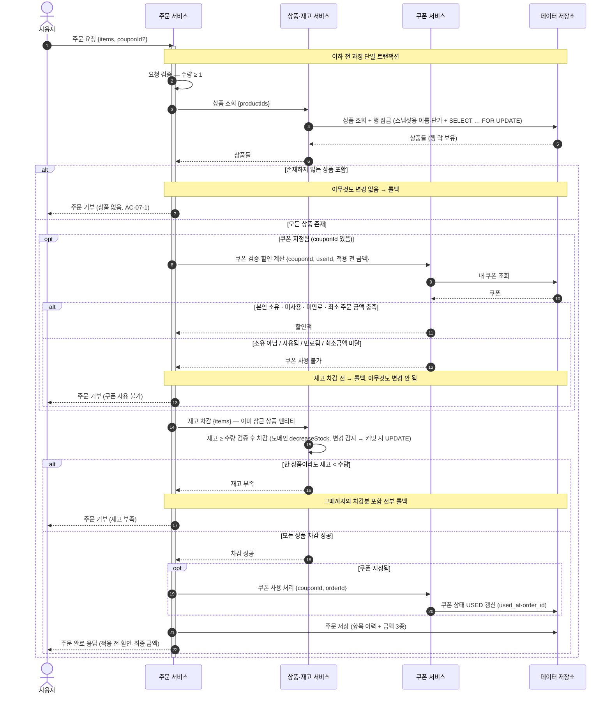
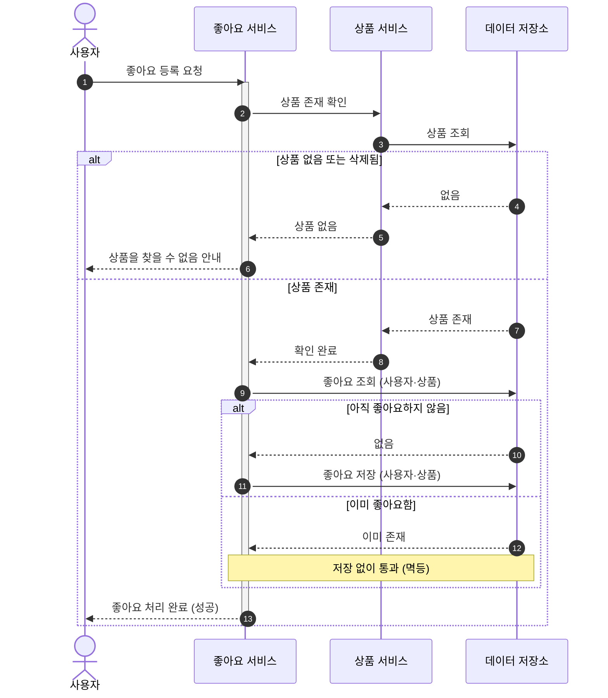
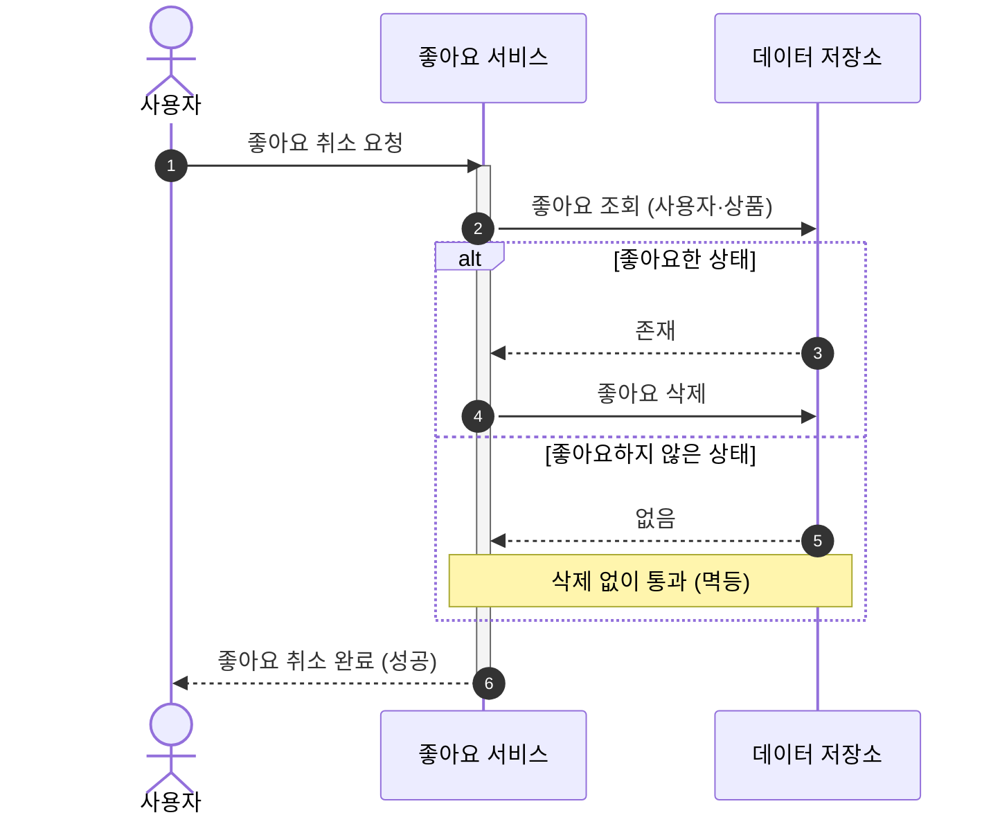
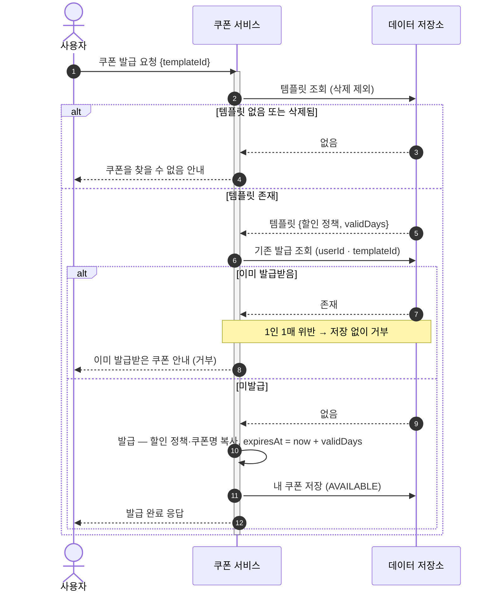

# 시퀀스 다이어그램

> 1단계 요구사항 명세서(`01-requirements.md`)의 유저 시나리오를, 시스템 안에서 **누가 무엇을 책임지고 어떤 순서로 처리하는지**로 풀어낸 문서다.
> 시퀀스 다이어그램으로 확인하려는 것: **책임 분리 · 호출 순서 · 정상/예외 흐름**.
> 분기와 여러 책임이 얽히는 **주문 생성**·**좋아요 등록·취소**·**쿠폰 발급** 세 시나리오만 다룬다 — 브랜드·상품·쿠폰 템플릿 CRUD/조회는 흐름이 단순해 별도 시퀀스를 두지 않고, 요구사항 명세서·3·4단계(클래스·ERD)에서 다룬다.

## 1. 주문 생성

**시나리오 개요**

- **목적**: 로그인 사용자가 여러 상품을 한 번에 주문한다(쿠폰 0~1장 사용 가능).
- **선행조건**: 로그인 상태, 주문 항목 1개 이상.
- **관련 요구사항**: US-07 (AC-07-1 ~ AC-07-9).

**참여자**

| 약어 | 정식명 | 역할 |
|------|--------|------|
| U | 사용자 | 주문을 요청하는 로그인 사용자 |
| O | 주문 서비스 | 주문 생성, 흐름 오케스트레이션, 주문 이력 보관 |
| P | 상품·재고 서비스 | 상품 조회(스냅샷 + 비관적 행 락), 재고 차감 |
| C | 쿠폰 서비스 | 쿠폰 소유·사용 가능 검증, 할인 계산, 사용 처리 |
| DB | 데이터 저장소 | 주문·상품·재고·쿠폰의 영속화 |

### 주문 생성 흐름

요청 검증 → 상품 조회(**비관적 쓰기 락**으로 잠가 로드) → 상품 존재 확인 → (쿠폰 지정 시) 쿠폰 검증·할인 계산을 거쳐, 모두 통과하면 **잠근 상품에 재고 차감**(도메인이 `재고 ≥ 수량` 검증 후 차감) → 쿠폰 사용 처리 → 주문 저장으로 이어진다. 상품 없음·쿠폰 사용 불가·재고 부족 중 하나라도 걸리면 아무것도 변경하지 않고 거부한다. 이 모든 과정은 **하나의 트랜잭션**으로 묶인다(AC-07-4·AC-07-8).

**해석** — 상품 조회에서 대상 행을 **비관적 쓰기 락으로 잠가 로드**한다(스냅샷용 이름·단가를 어차피 읽어야 하므로 그 조회에 락을 얹는다). 존재 확인에서 먼저 갈리고(없으면 거부, AC-07-1), 쿠폰이 지정된 경우에만 쿠폰 검증·할인 계산(`opt`)이 끼어든다. **재고 충분성은 도메인이 `재고 ≥ 수량`을 검증한 뒤 차감**하며(부족하면 거부), 차감은 잠근 엔티티의 변경 감지로 커밋 시 UPDATE에 반영된다. 동시 주문은 같은 상품 행 락에 직렬화되므로 read-modify-write 간극이 사라져 oversell이 차단된다. 쿠폰이 사용 불가면(소유 아님/사용됨/만료됨/최소금액 미달, AC-07-7) **재고 차감 이전에** 거부하므로 재고도 쿠폰도 변하지 않는다. 모두 통과하면 재고 차감 → 쿠폰 사용 처리(`USED` 전이, AC-07-8) → 주문 저장(금액 3종 스냅샷, AC-07-6) 순으로 진행된다. 할인 계산은 **쿠폰 서비스가 책임지고**(최소 주문 금액 검사 포함), 주문 서비스는 그 결과 할인액만 받아 최종 금액을 산출한다.

> **락 시점** — 상품 행 락을 **조회(로드) 시점에 미리** 잡는다(lock at load): 어차피 스냅샷용으로 상품을 읽어야 하므로 그 한 번의 조회에 `FOR UPDATE`를 얹는 게 가장 단순하다. 대가로 락을 쿠폰 검증·차감·커밋까지 **계속 보유**하지만, 그 구간에 외부 호출 없이 in-memory 연산과 짧은 DB 쓰기뿐이라 보유 시간이 짧다. 쿠폰 소유·사용 가능 검증은 차감(상태 변경)보다 앞서 두어, 실패 시 헛된 쓰기를 피한다(fail-cheap-first). 모든 검증이 실패해도 전체 롤백이라 순서가 정합성에는 영향이 없다.
> **데드락 회피** — 여러 상품을 단일 `WHERE id IN (...)` FOR UPDATE로 한 번에 잠그며, InnoDB가 PK 순서로 행 락을 잡으므로 동시 주문들이 같은 순서로 락을 획득해 순환 대기(데드락)가 생기지 않는다.
> 전 과정이 단일 트랜잭션이므로, 어느 단계에서 거부되든 그때까지의 재고 차감·쿠폰 사용은 롤백되어 흔적이 남지 않는다(AC-07-4·AC-07-8). 한 쿠폰이 동시에 두 주문에 사용되는 중복 사용은 `user_coupons`의 **낙관적 락(`@Version`)** 으로 막는다 — 동시 사용 시 한쪽만 성공하고 나머지는 충돌로 이 트랜잭션 전체가 롤백된다(ERD 참조).

---

## 2. 좋아요 등록·취소

**시나리오 개요**

- **목적**: 로그인 사용자가 상품 좋아요를 등록/취소한다.
- **선행조건**: 로그인 상태.
- **관련 요구사항**: US-04 (AC-04-1 ~ 4), US-05 (AC-05-1 ~ 4).

**참여자**

| 약어 | 정식명 | 역할 |
|------|--------|------|
| U | 사용자 | 좋아요를 누르는 로그인 사용자 |
| L | 좋아요 서비스 | 좋아요 등록/취소, **멱등 판정**(이미 있는지 확인) |
| P | 상품 서비스 | 상품 존재 확인 (좋아요 등록 시) |
| DB | 데이터 저장소 | 좋아요·상품의 영속화 |

### 좋아요 등록

**해석** — 멱등의 핵심은 좋아요 행이 **실제로 생겼는지**다. 등록은 `INSERT IGNORE`로 시도해 영향 행 수가 1(신규)일 때만 `products.like_count`를 **원자적으로 +1** 한다 — 이미 있으면 0행이라 카운터를 건드리지 않고 **그대로 성공**으로 응답한다(AC-04-2). 취소도 대칭으로 `DELETE` 영향 행 수가 1일 때만 `-1`. 좋아요 수는 행을 비정규화한 카운터라, 고경합에서도 원자적 UPDATE로 lost update 없이 정확히 반영된다(4단계 ERD `products` 참조).

### 좋아요 취소

**해석** — 등록과 대칭이다. 좋아요하지 않은 상품을 취소해도 오류 없이 성공으로 처리한다(AC-05-2). 취소는 "상품이 없으면 좋아요도 없다"는 관계라, 상품 존재 확인을 따로 두지 않고 좋아요 유무로만 분기한다(AC-05-4) — 좋아요 서비스 안에서 끝난다.

---

## 3. 쿠폰 발급

**시나리오 개요**

- **목적**: 로그인 사용자가 쿠폰 템플릿으로 자신의 쿠폰을 발급받는다.
- **선행조건**: 로그인 상태.
- **관련 요구사항**: US-19 (AC-19-1 ~ 4).

**참여자**

| 약어 | 정식명 | 역할 |
|------|--------|------|
| U | 사용자 | 쿠폰을 발급받는 로그인 사용자 |
| C | 쿠폰 서비스 | 템플릿 확인, 중복 발급 판정, 발급(스냅샷 복사) |
| DB | 데이터 저장소 | 쿠폰 템플릿·내 쿠폰의 영속화 |

### 쿠폰 발급 흐름

템플릿 존재를 확인하고, 같은 템플릿을 이미 발급받았는지(1인 1매) 검사한 뒤, 통과하면 발급 시점의 혜택·이름·만료일을 복사해 내 쿠폰을 저장한다. 좋아요 등록과 달리 **중복 발급은 멱등 통과가 아니라 거부**한다(AC-19-2).

**해석** — 두 번 분기한다. 먼저 템플릿이 없거나 삭제됐으면 거부하고(AC-19-3), 다음으로 같은 (사용자, 템플릿) 쌍이 이미 있으면 거부한다(AC-19-2). 발급 시점에 템플릿의 할인 정책·이름을 **복사(스냅샷)** 하고 만료일을 확정(`now + validDays`)하므로, 이후 템플릿이 수정·삭제돼도 이 쿠폰은 자립한다(클래스 다이어그램 `UserCoupon` 참조). 애플리케이션의 중복 확인이 동시성으로 뚫려도 `user_coupons (user_id, template_id)` 유니크 제약이 최종 방어선이 된다(ERD 참조).
