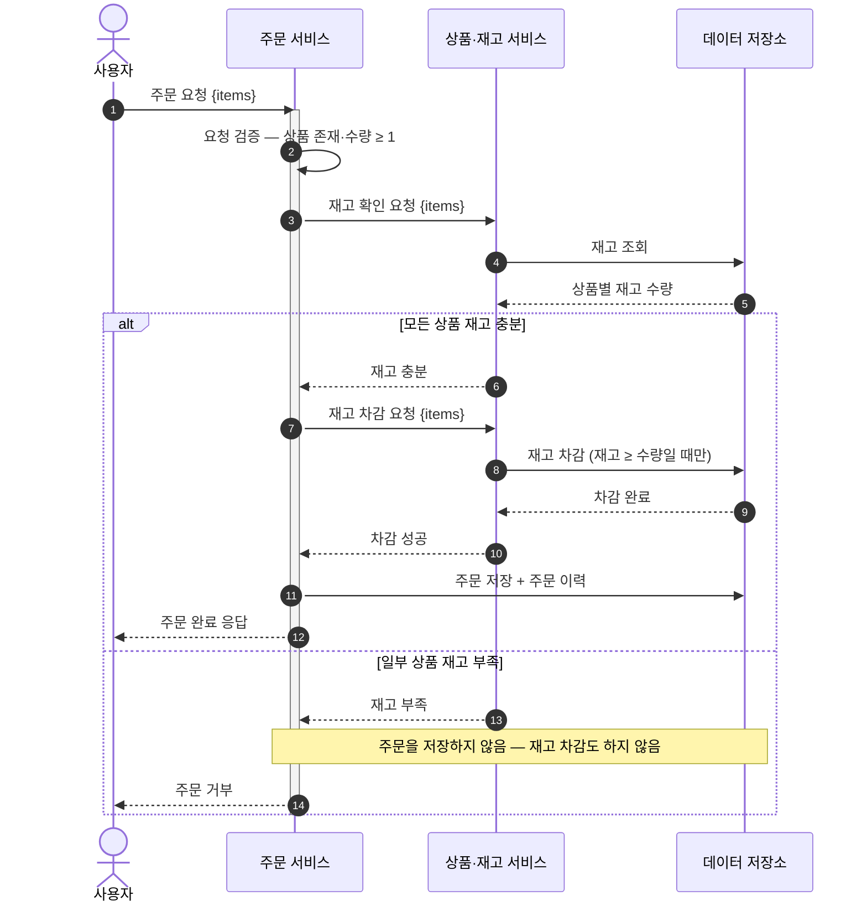
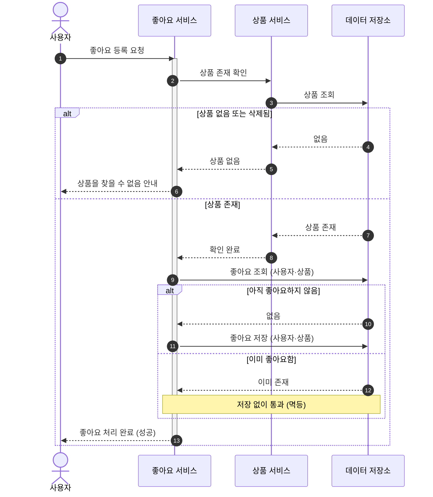
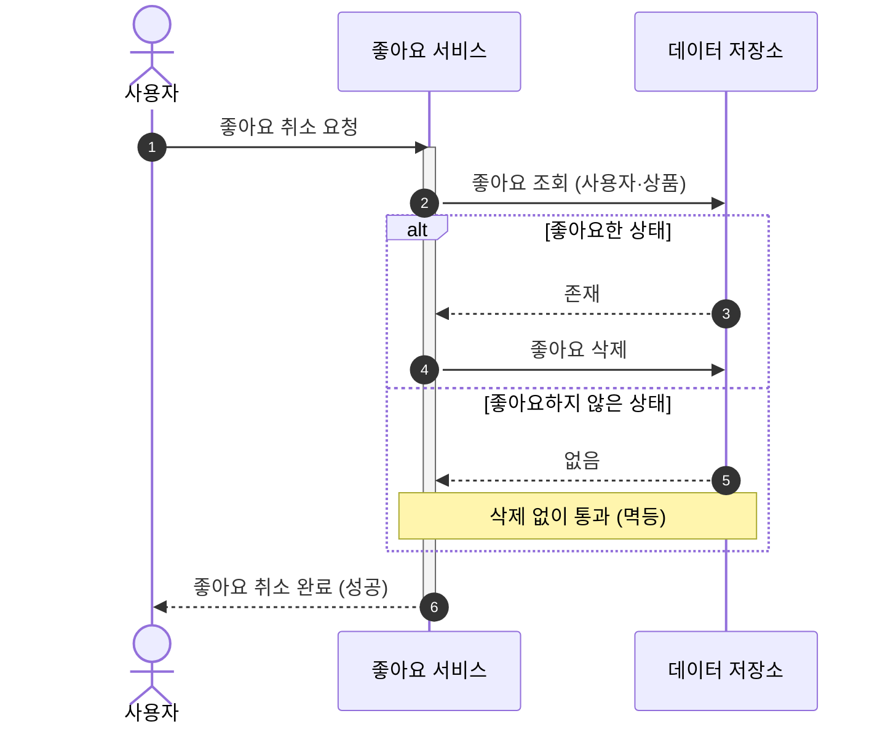

# 시퀀스 다이어그램

> 1단계 요구사항 명세서(`01-requirements.md`)의 유저 시나리오를, 시스템 안에서 **누가 무엇을 책임지고 어떤 순서로 처리하는지**로 풀어낸 문서다.
> 시퀀스 다이어그램으로 확인하려는 것: **책임 분리 · 호출 순서 · 정상/예외 흐름**.
> 분기와 여러 책임이 얽히는 **주문 생성**·**좋아요 등록·취소** 두 시나리오만 다룬다 — 브랜드·상품 CRUD/조회는 흐름이 단순해 별도 시퀀스를 두지 않고, 요구사항 명세서·3·4단계(클래스·ERD)에서 다룬다.

## 1. 주문 생성

**시나리오 개요**

- **목적**: 로그인 사용자가 여러 상품을 한 번에 주문한다.
- **선행조건**: 로그인 상태, 주문 항목 1개 이상.
- **관련 요구사항**: US-07 (AC-07-1 ~ AC-07-5).

**참여자**

| 약어 | 정식명 | 역할 |
|------|--------|------|
| U | 사용자 | 주문을 요청하는 로그인 사용자 |
| O | 주문 서비스 | 주문 생성, 흐름 오케스트레이션, 주문 이력 보관 |
| P | 상품·재고 서비스 | 재고 확인, 재고 차감 |
| DB | 데이터 저장소 | 주문·상품·재고의 영속화 |

### 주문 생성 흐름

요청 검증과 재고 확인을 거쳐, 재고가 충분하면 차감 → 주문 저장으로 이어지고, 하나라도 부족하면 주문을 만들지 않고 거부한다. 두 경로는 재고 확인 결과에서 갈리므로 `alt` 결합 프래그먼트로 한 다이어그램에 담는다.

**해석** — 재고 확인(③~⑤) 결과에서 흐름이 갈린다. 충분하면 차감(⑦~⑩) 뒤 주문을 저장(⑪)하고, 하나라도 부족하면 **주문을 아예 만들지 않고** 재고도 차감하지 않는다(AC-07-3). 재고 차감과 주문 저장은 하나의 처리 단위로 묶여(AC-07-4), 주문 행이 쓰였다면 재고는 이미 줄어 있다.

> 요청 검증(②)에서 존재하지 않는 상품이 포함되거나 수량이 1 미만이면(AC-07-1), 재고 확인 이전에 같은 방식으로 주문을 거부한다.

---

## 2. 좋아요 등록·취소

**시나리오 개요**

- **목적**: 로그인 사용자가 상품 좋아요를 등록/취소한다.
- **선행조건**: 로그인 상태.
- **관련 요구사항**: US-04 (AC-04-1 ~ 4), US-05 (AC-05-1 ~ 4).

**참여자**

| 약어 | 정식명 | 역할 |
|------|--------|------|
| U | 사용자 | 좋아요를 누르는 로그인 사용자 |
| L | 좋아요 서비스 | 좋아요 등록/취소, **멱등 판정**(이미 있는지 확인) |
| P | 상품 서비스 | 상품 존재 확인 (좋아요 등록 시) |
| DB | 데이터 저장소 | 좋아요·상품의 영속화 |

### 좋아요 등록

**해석** — 멱등의 핵심은 좋아요 조회 직후의 '이미 좋아요함' 분기다. 이미 있으면 좋아요를 저장하지 않고 **그대로 성공**으로 응답한다(AC-04-2). 처음 누른 경우에만 좋아요를 저장한다. 좋아요 수는 저장하지 않으므로 등록은 `좋아요` 한 곳만 건드린다.

### 좋아요 취소

**해석** — 등록과 대칭이다. 좋아요하지 않은 상품을 취소해도 오류 없이 성공으로 처리한다(AC-05-2). 취소는 "상품이 없으면 좋아요도 없다"는 관계라, 상품 존재 확인을 따로 두지 않고 좋아요 유무로만 분기한다(AC-05-4) — 좋아요 서비스 안에서 끝난다.
