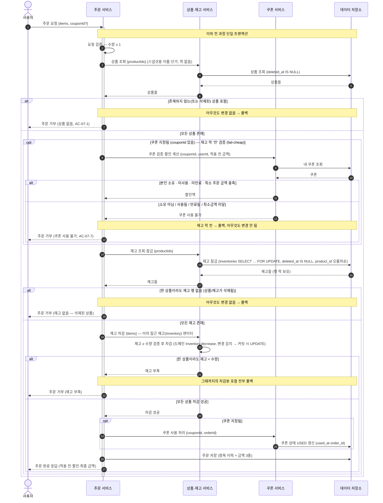
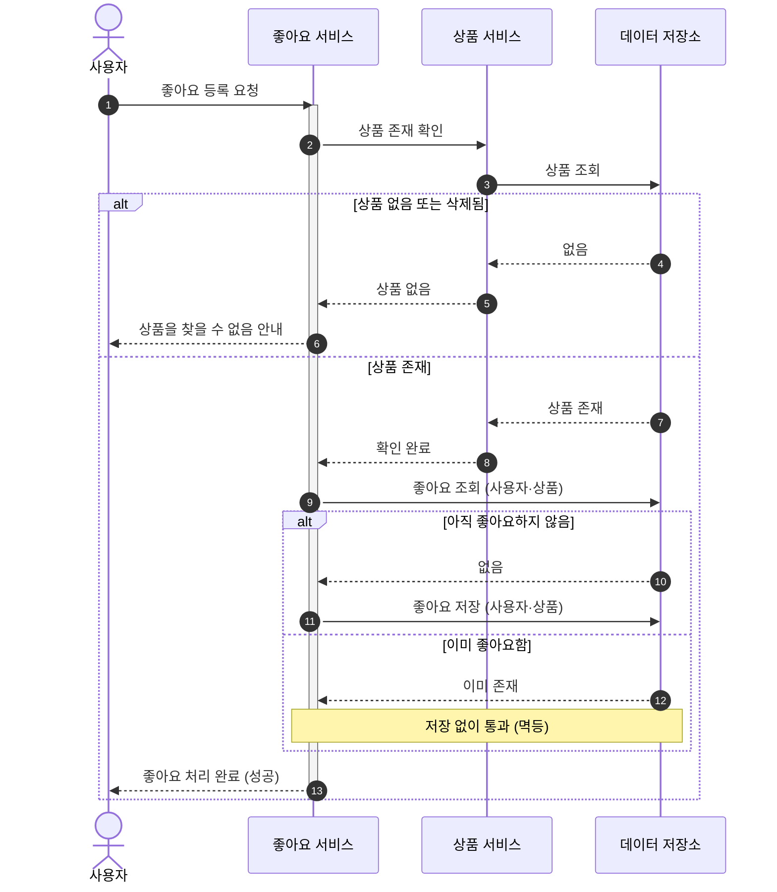
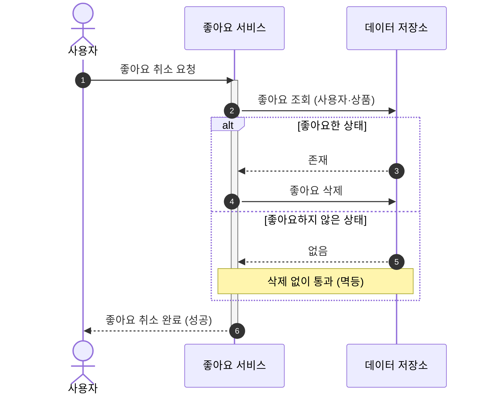
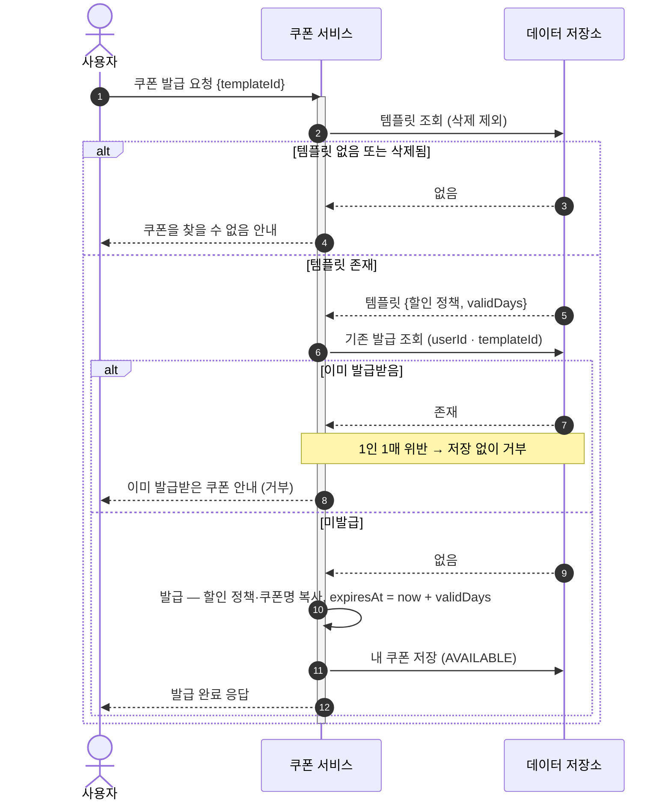
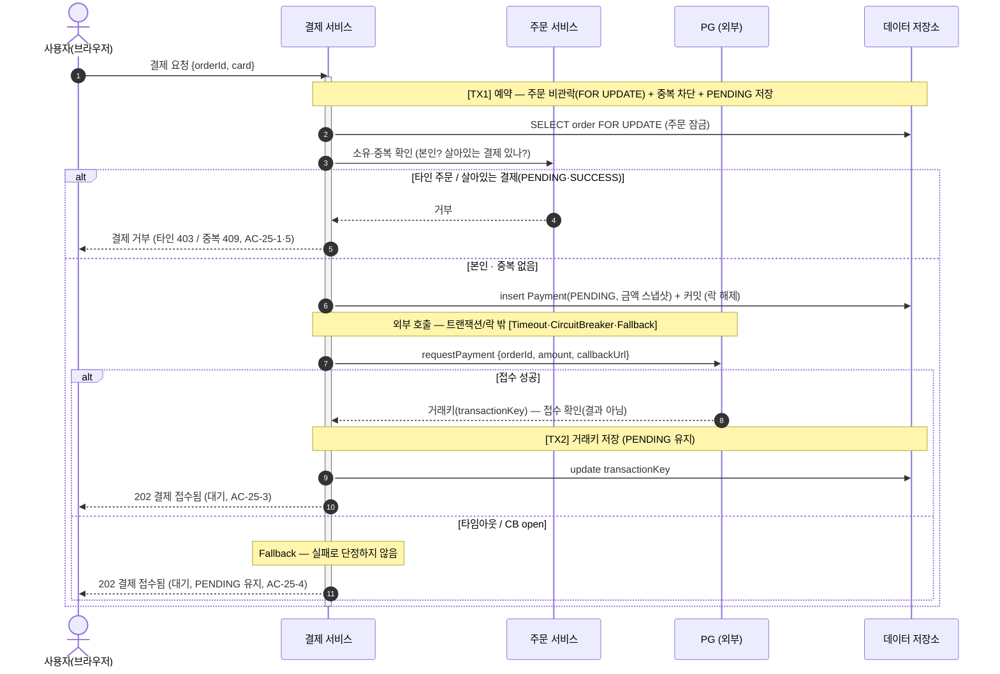
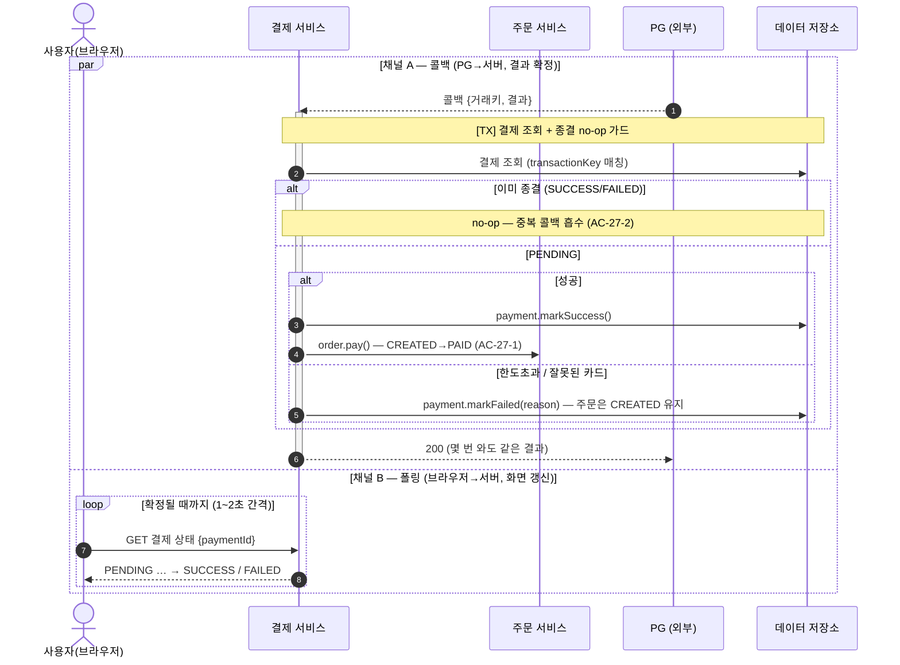
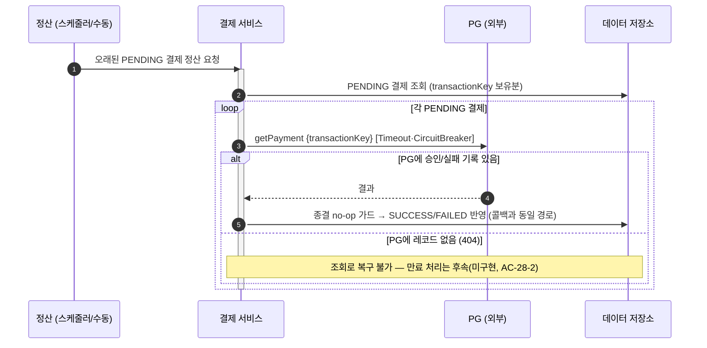

# 시퀀스 다이어그램

> 1단계 요구사항 명세서(`01-requirements.md`)의 유저 시나리오를, 시스템 안에서 **누가 무엇을 책임지고 어떤 순서로 처리하는지**로 풀어낸 문서다.
> 시퀀스 다이어그램으로 확인하려는 것: **책임 분리 · 호출 순서 · 정상/예외 흐름**.
> 분기와 여러 책임이 얽히는 **주문 생성**·**좋아요 등록·취소**·**쿠폰 발급**·**결제(PG 연동)** 시나리오를 다룬다 — 브랜드·상품·쿠폰 템플릿 CRUD/조회는 흐름이 단순해 별도 시퀀스를 두지 않고, 요구사항 명세서·3·4단계(클래스·ERD)에서 다룬다.
> 결제(4번)는 **외부 시스템(PG)** 이 우리 트랜잭션 밖에 있어, 정상 흐름보다 **끊겼을 때(지연·실패·중복·응답 유실)** 내부/외부 상태가 어긋나는 지점과 그 복구(콜백·정산)에 초점을 둔다.

## 1. 주문 생성

**시나리오 개요**

- **목적**: 로그인 사용자가 여러 상품을 한 번에 주문한다(쿠폰 0~1장 사용 가능).
- **선행조건**: 로그인 상태, 주문 항목 1개 이상.
- **관련 요구사항**: US-07 (AC-07-1 ~ AC-07-9).

**참여자**

| 약어 | 정식명 | 역할 |
|------|--------|------|
| U | 사용자 | 주문을 요청하는 로그인 사용자 |
| O | 주문 서비스 | 주문 생성, 흐름 오케스트레이션, 주문 이력 보관 |
| P | 상품·재고 서비스 | 상품 조회(스냅샷 + 비관적 행 락), 재고 차감 |
| C | 쿠폰 서비스 | 쿠폰 소유·사용 가능 검증, 할인 계산, 사용 처리 |
| DB | 데이터 저장소 | 주문·상품·재고·쿠폰의 영속화 |

### 주문 생성 흐름

요청 검증 → 상품 조회(스냅샷용, **락 없음**) → 상품 존재 확인 → (쿠폰 지정 시) 쿠폰 검증·할인 계산 → 그다음 재고(`Inventory`) 조회(**비관적 쓰기 락**으로 잠가 로드) → **잠근 재고에 차감**(도메인이 `재고 ≥ 수량` 검증 후 차감) → 쿠폰 사용 처리 → 주문 저장으로 이어진다. 상품 없음·쿠폰 사용 불가·재고 부족 중 하나라도 걸리면 아무것도 변경하지 않고 거부한다. 이 모든 과정은 **하나의 트랜잭션**으로 묶인다(AC-07-4·AC-07-8). 쿠폰 검증을 **재고 락보다 앞에** 두어, 타인/사용된 쿠폰 같은 흔한 실패가 인기 상품 핫 로우 락을 점유하지 않게 한다(fail-cheap-first). 재고를 `products`에서 분리해 별도 `inventories` 행을 잠그므로, 주문 락이 좋아요 카운터 등 무관한 `products` 쓰기와 충돌하지 않는다(false sharing 제거 — 4단계 ERD `inventories`).

**해석** — 상품은 스냅샷용(이름·단가)이라 **락 없이** 읽는다. 존재 확인에서 먼저 갈리고(없거나 삭제됐으면 거부, AC-07-1), 쿠폰이 지정된 경우 쿠폰 검증·할인 계산(`opt`)을 **재고 락보다 먼저** 끝낸다(fail-cheap). 그다음 차감 대상인 **재고(`Inventory`) 행만 비관적 쓰기 락으로 잠가 로드**한다 — 삭제된 상품은 재고 행도 소프트 삭제돼 `deleted_at IS NULL` 필터에 걸리지 않으므로, 잠글 재고가 없으면 "재고 없음"으로 거부된다(삭제↔주문 경쟁 차단). **재고 충분성은 도메인이 `재고 ≥ 수량`을 검증한 뒤 차감**하며(부족하면 거부), 차감은 잠근 엔티티의 변경 감지로 커밋 시 UPDATE에 반영된다. 동시 주문은 같은 재고 행 락에 직렬화되므로 read-modify-write 간극이 사라져 oversell이 차단된다. 모두 통과하면 재고 차감 → 쿠폰 사용 처리(`USED` 전이, AC-07-8) → 주문 저장(금액 3종 스냅샷, AC-07-6) 순으로 진행된다. 할인 계산은 **쿠폰 서비스가 책임지고**(최소 주문 금액 검사 포함), 주문 서비스는 그 결과 할인액만 받아 최종 금액을 산출한다.

> **락 시점** — 재고(`Inventory`) 행 락을 **쿠폰 검증을 통과한 뒤** 잡는다. 인기 상품 핫 로우 락을 가장 흔한 실패(타인/사용된 쿠폰) 뒤로 미뤄, 무효 쿠폰 주문이 락을 점유하지 않게 한다(fail-cheap-first). 락을 잡은 뒤로는 차감·쿠폰 사용·커밋까지 보유하지만, 외부 호출 없이 in-memory 연산과 짧은 DB 쓰기뿐이라 보유 시간이 짧다. 최종 쿠폰 중복 사용은 커밋 시 `@Version` 낙관 락이 막는다.
> **데드락 회피** — 여러 재고를 `findAllByProductIdInAndDeletedAtIsNullOrderByProductIdAsc`로 **product_id 오름차순** 잠가, 동시 주문들이 같은 순서로 락을 획득해 순환 대기(데드락)가 생기지 않는다.
> **삭제↔주문 경쟁** — 상품 삭제는 상품과 **그 재고를 함께 소프트 삭제**한다. 삭제의 재고 UPDATE 가 같은 행 락을 잡아 주문의 `FOR UPDATE` 와 직렬화되고, 주문의 락 조회는 `deleted_at IS NULL` 로 필터하므로 — 삭제가 먼저면 주문은 재고를 못 잠그고 거부, 주문이 먼저면 정상 차감 후 삭제로 깔끔히 갈린다(4단계 ERD `inventories`).
> 전 과정이 단일 트랜잭션이므로, 어느 단계에서 거부되든 그때까지의 재고 차감·쿠폰 사용은 롤백되어 흔적이 남지 않는다(AC-07-4·AC-07-8). 한 쿠폰이 동시에 두 주문에 사용되는 중복 사용은 `user_coupons`의 **낙관적 락(`@Version`)** 으로 막는다 — 동시 사용 시 한쪽만 성공하고 나머지는 충돌로 이 트랜잭션 전체가 롤백된다(ERD 참조).

---

## 2. 좋아요 등록·취소

**시나리오 개요**

- **목적**: 로그인 사용자가 상품 좋아요를 등록/취소한다.
- **선행조건**: 로그인 상태.
- **관련 요구사항**: US-04 (AC-04-1 ~ 4), US-05 (AC-05-1 ~ 4).

**참여자**

| 약어 | 정식명 | 역할 |
|------|--------|------|
| U | 사용자 | 좋아요를 누르는 로그인 사용자 |
| L | 좋아요 서비스 | 좋아요 등록/취소, **멱등 판정**(이미 있는지 확인) |
| P | 상품 서비스 | 상품 존재 확인 (좋아요 등록 시) |
| DB | 데이터 저장소 | 좋아요·상품의 영속화 |

### 좋아요 등록

**해석** — 멱등의 핵심은 좋아요 행이 **실제로 생겼는지**다. 등록은 `INSERT IGNORE`로 시도해 영향 행 수가 1(신규)일 때만 `products.like_count`를 **원자적으로 +1** 한다 — 이미 있으면 0행이라 카운터를 건드리지 않고 **그대로 성공**으로 응답한다(AC-04-2). 취소도 대칭으로 `DELETE` 영향 행 수가 1일 때만 `-1`. 좋아요 수는 행을 비정규화한 카운터라, 고경합에서도 원자적 UPDATE로 lost update 없이 정확히 반영된다(4단계 ERD `products` 참조).

### 좋아요 취소

**해석** — 등록과 대칭이다. 좋아요하지 않은 상품을 취소해도 오류 없이 성공으로 처리한다(AC-05-2). 취소는 "상품이 없으면 좋아요도 없다"는 관계라, 상품 존재 확인을 따로 두지 않고 좋아요 유무로만 분기한다(AC-05-4) — 좋아요 서비스 안에서 끝난다.

---

## 3. 쿠폰 발급

**시나리오 개요**

- **목적**: 로그인 사용자가 쿠폰 템플릿으로 자신의 쿠폰을 발급받는다.
- **선행조건**: 로그인 상태.
- **관련 요구사항**: US-19 (AC-19-1 ~ 4).

**참여자**

| 약어 | 정식명 | 역할 |
|------|--------|------|
| U | 사용자 | 쿠폰을 발급받는 로그인 사용자 |
| C | 쿠폰 서비스 | 템플릿 확인, 중복 발급 판정, 발급(스냅샷 복사) |
| DB | 데이터 저장소 | 쿠폰 템플릿·내 쿠폰의 영속화 |

### 쿠폰 발급 흐름

템플릿 존재를 확인하고, 같은 템플릿을 이미 발급받았는지(1인 1매) 검사한 뒤, 통과하면 발급 시점의 혜택·이름·만료일을 복사해 내 쿠폰을 저장한다. 좋아요 등록과 달리 **중복 발급은 멱등 통과가 아니라 거부**한다(AC-19-2).

**해석** — 두 번 분기한다. 먼저 템플릿이 없거나 삭제됐으면 거부하고(AC-19-3), 다음으로 같은 (사용자, 템플릿) 쌍이 이미 있으면 거부한다(AC-19-2). 발급 시점에 템플릿의 할인 정책·이름을 **복사(스냅샷)** 하고 만료일을 확정(`now + validDays`)하므로, 이후 템플릿이 수정·삭제돼도 이 쿠폰은 자립한다(클래스 다이어그램 `UserCoupon` 참조). 애플리케이션의 중복 확인이 동시성으로 뚫려도 `user_coupons (user_id, template_id)` 유니크 제약이 최종 방어선이 된다(ERD 참조).

---

## 4. 결제 (PG 연동) — Round 6

**시나리오 개요**

- **목적**: 로그인 사용자가 생성된(`CREATED`) 주문을 외부 PG로 결제한다. PG는 비동기라 요청은 *접수*만 확인하고, 결과는 콜백/조회로 확정한다.
- **선행조건**: 로그인 상태, 본인 소유의 `CREATED` 주문 존재.
- **관련 요구사항**: US-25 ~ US-28 (AC-25-1 ~ AC-28-2).

**참여자**

| 약어 | 정식명 | 역할 |
|------|--------|------|
| U | 사용자(브라우저) | 결제를 요청하고, 결과 확정까지 상태를 **폴링**한다 |
| Pay | 결제 서비스 | 결제 저장(`PENDING`)·PG 호출 오케스트레이션, 콜백/정산 결과 반영, 멱등 처리 |
| O | 주문 서비스 | 주문 소유·상태 확인, 성공 시 `PAID` 전이 |
| PG | PG(외부) | 카드 승인 대행. 접수 응답 + 콜백/상태조회 제공(우리 트랜잭션 밖) |
| DB | 데이터 저장소 | 결제·주문의 영속화 |

> **경계(0단계)** — 모든 정합성 위험의 뿌리는 **외부 호출 지점과 DB 커밋 지점의 순서**다. 본 설계는 ① 결제(`PENDING`)를 **먼저 커밋**하고(TX1), ② PG 호출은 **트랜잭션 밖**에서 하며(Timeout/CB/Fallback), ③ 거래키만 따로 저장한다(TX2). 결과 확정은 콜백/정산이 별도 트랜잭션으로 한다.

### 4-1. 결제 요청 (US-25)

요청을 받으면 **주문 행을 비관락(FOR UPDATE)으로 잡고** 소유·중복(같은 주문에 살아있는 결제)을 확인한 뒤, 결제를 `PENDING`으로 저장하고 커밋한다(락 해제). 그다음 트랜잭션/락 **밖에서** PG에 결제를 요청한다 — 접수되면 거래키를 저장(여전히 `PENDING`)하고, 타임아웃/차단되면 Fallback으로 `PENDING`을 유지한 채 "접수됨"으로 응답한다(타임아웃=모름). 즉 이 단계의 응답은 어떤 경로든 **"접수(PENDING)"** 이고, 성공/실패는 4-2/4-3가 정한다.

**해석** — 결제를 **먼저 `PENDING`으로 커밋**하는 이유는 두 가지다. ① 외부 호출을 트랜잭션 밖으로 빼 커넥션·락이 PG 응답 시간에 묶이지 않게 하고(자원 보호), ② 이후 콜백/정산이 **매칭할 대상이 항상 존재**하게 한다(dual-write 안전 순서). 따닥(동시 결제)은 **주문 행 비관락(FOR UPDATE)으로 직렬화**한다 — `if 존재? 차단 : 생성`(read-then-write)은 동시 더블클릭이 둘 다 "없음"을 읽는 창이 있으나, 예약 트랜잭션이 주문 행을 먼저 잡아 **검사+삽입을 한 번에** 처리하므로 패자는 승자가 커밋한 `PENDING`을 보고 `CONFLICT`가 된다(차단 기준은 SUCCESS만이 아니라 **살아있는 시도(PENDING·SUCCESS)** — 결과가 콜백으로 뒤늦게 찍히기 전에 막아야 PG 이중 청구를 차단할 수 있다). 락은 검사+삽입에만 걸고 **PG 호출 전에 해제**한다(외부 호출을 락 안에 품지 않음). PG 응답은 **접수 확인일 뿐 결과가 아니라서**, 접수돼도 `PENDING`을 유지하고, 타임아웃·차단도 실패가 아니라 `PENDING`으로 둔다(타임아웃=모름).

> **요청 타임아웃 ≠ 처리 대기** — 요청 타임아웃은 *접수*까지만 짧게 잡는다(요청지연 상한 + 여유). 카드 *처리* 지연은 타임아웃 대상이 아니라 콜백/정산으로 기다린다 — 이 둘을 섞어 타임아웃을 길게 잡으면 스레드를 처리 시간만큼 점유한다.
> **재결제(AC-25-6)** — 4-2에서 결제가 `FAILED`로 끝나도 주문은 `CREATED`다. `FAILED`는 "살아있는 시도"가 아니므로 예약의 중복 가드를 통과하고, 사용자가 카드를 바꿔 다시 요청하면 이 흐름을 그대로 타며 **새 Payment(시도)** 가 생긴다(재고·쿠폰은 주문에 묶여 재차감 없음). 반대로 직전 시도가 `PENDING`(in-doubt 포함)으로 살아있으면 차단된다 — 청구 여부를 모르는 채 병렬 시도를 허용하지 않는다.

### 4-2. 결제 결과 확정 — 콜백 (US-27) · 폴링 (US-26)

결과는 **두 개의 독립 채널**로 다뤄진다. **콜백**(PG→서버)이 결제·주문 상태를 *확정*하고, **폴링**(브라우저→서버)은 그 확정된 상태를 *읽어* 화면을 갱신한다. 브라우저는 콜백을 직접 받을 수 없다(콜백은 서버로 온다).

**해석** — **종결 no-op 가드**가 멱등의 핵심이다: 종결 상태(`SUCCESS`/`FAILED`)에서는 추가 콜백을 무시하고(no-op, AC-27-2), `PENDING`에서만 전이한다. 콜백과 정산(4-3)이 같은 결제를 동시에 종결시키려는 경쟁은 이 가드가 흡수한다 — `markSuccess()`/`markFailed()`가 종결 상태에서 전이를 무시(`false` 반환)하고, **전이가 실제 일어났을 때만** `order.pay()`를 호출하므로 같은 값으로의 동시 전이는 무해하다(AC-27-3). 지금은 `order.pay()`가 순수 상태 전이라 별도 락 없이 안전하지만, `PAID`에 적립·알림 같은 부작용이 붙으면 이중 실행 위험이 생기므로 그 시점에 낙관락(`@Version`)을 도입한다(**현재 미적용**). 브라우저는 콜백이 바꾼 **우리 DB 상태**를 폴링으로 읽을 뿐, PG를 직접 보지 않는다.

> **콜백 매칭 = transactionKey** — 현재 콜백/조회의 결제 매칭은 PG가 부여한 `transactionKey`로 한다. 요청 타임아웃으로 거래키 응답이 유실된 결제(in-doubt)는 이 매칭으로는 결과를 못 붙이므로, `orderId`를 상관키로 쓰는 매칭과 주문 기준 정산(reconcile-by-orderId)은 **후속 하드닝으로 남긴다(AC-27-4, 미구현)**.

### 4-3. 정산/복구 (US-28)

콜백이 오지 않아 오래 `PENDING`인 결제를, 시스템이 PG **상태 조회**로 확인해 정합성을 맞춘다(콜백 유실 안전망). 콜백과 **같은 전이 가드**를 적용해, 이미 종결된 건은 건너뛴다.

**해석** — 정산은 "콜백을 못 받아도 살아남기" 위한 이중화다. 현재 구현은 **transactionKey를 보유한 PENDING 결제**를 PG에 되물어, 승인/실패 기록이 있으면 콜백과 같은 종결 no-op 가드로 반영해 영구 `PENDING`을 막는다. 정산의 PG 조회도 외부 호출이라 Timeout·CircuitBreaker를 동일하게 적용한다.

> **후속(미구현)** — ① 거래키가 없는 PENDING(요청 타임아웃으로 응답 유실된 in-doubt, 또는 미접수)은 키가 없어 위 경로로 복구할 수 없다 → `orderId` 기준 PG 조회(reconcile-by-orderId)가 필요하다. ② "조회 불가 + 시간 경과 → 시도 만료" 처리도 아직 없다(AC-28-2). pg-simulator는 `findByOrderId`를 제공하므로 ①의 복구 핸들은 존재한다.

> **상태 어긋남 표(요약)** — 내부 결제 상태와 PG 실제 상태가 어긋나는 조합과 복구 주체:
> | 내부 | PG 실제 | 발생 경로 | 복구 |
> |---|---|---|---|
> | PENDING(키 보유) | 승인됨 | 콜백 유실 | 정산(transactionKey 조회) |
> | PENDING(키 없음) | 승인됨 | 요청 타임아웃(in-doubt) | orderId 조회 — 후속(미구현) |
> | PENDING | 레코드 없음 | 요청 미접수 | 만료·재시도 — 후속(미구현, AC-28-2) |
> | SUCCESS | 승인됨(콜백 2회) | at-least-once | 종결 no-op 가드 |
> | FAILED | 승인됨 | "타임아웃→실패" 단정 시 | **단정 안 함**으로 차단 |
