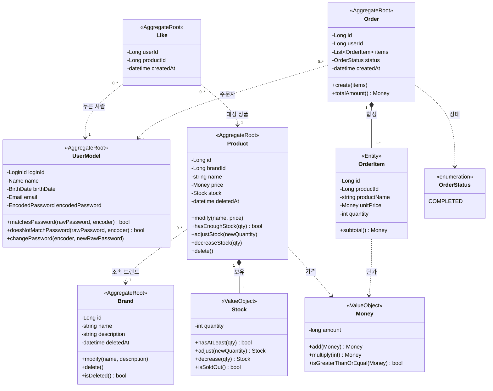
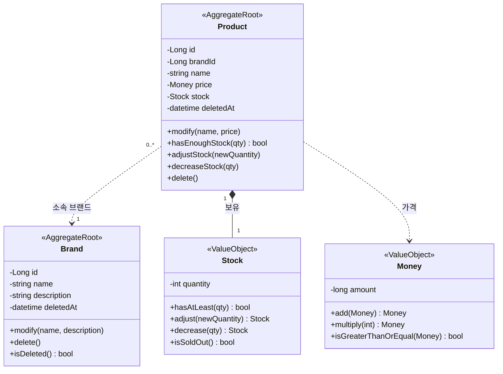
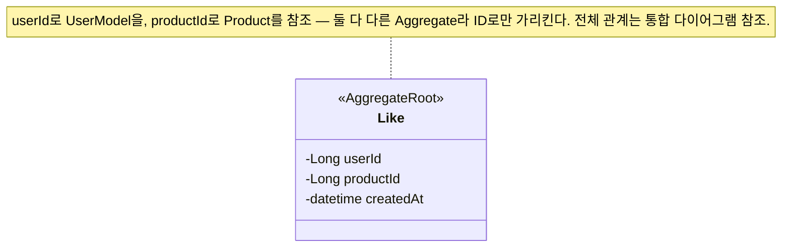
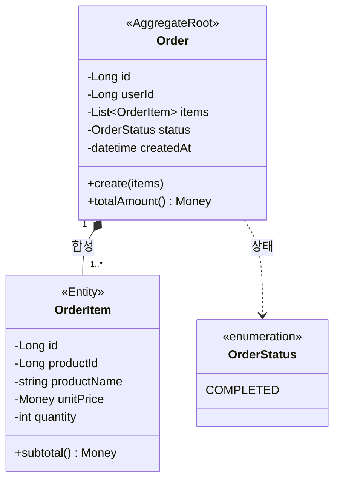

# 도메인 클래스 다이어그램

## 이 문서의 목적

요구사항(1단계)과 시퀀스(2단계)에 등장한 도메인을 **객체의 책임·관계**로 모델링한다. 검증하려는 것은 도메인 책임 / 의존 방향 / 응집도 세 가지다. 응용 서비스·Repository 같은 계층 객체는 도메인 행위가 아니므로 이 다이어그램에서 다루지 않는다 — 오케스트레이션·영속화 책임은 시퀀스 다이어그램(2단계)에서 본다.

문서는 **두 층**으로 본다 — 맨 위에 도메인 전체를 잇는 **통합 클래스 다이어그램** 하나를 두어 Aggregate 사이 참조를 조망하고, 그 아래에서 **도메인별로 쪼개** 각 영역의 객체를 자세히 설명한다.

## 한눈에 — Aggregate 5개

외부에서는 각 Aggregate의 대표 객체(Root)로만 접근한다.

| Aggregate | Root | 책임지는 핵심 불변식 |
|-----------|------|----------------------|
| 사용자 | `UserModel` | 로그인 ID는 유일하다. 식별·인증 정보는 모두 필수다. |
| 브랜드 | `Brand` | 브랜드명은 비어 있을 수 없다. 삭제는 논리 삭제. |
| 상품 | `Product` | 가격·재고는 음수가 될 수 없다. 소속 브랜드는 바뀌지 않는다. |
| 좋아요 | `Like` | 한 사용자-상품 쌍에 좋아요는 최대 1개. |
| 주문 | `Order` | 총액 = 항목 소계의 합. 주문 이력은 불변. |

---

## 통합 클래스 다이어그램

도메인 전체를 한 그림으로 본다. `Money`는 두 영역(`Product`·`OrderItem`)이 공유하는 값 객체라 한 번만 정의하고 쓰는 쪽에서 참조한다.

**관계 읽는 법** — `*--`(합성)은 부모가 사라지면 자식도 사라지는 한 Aggregate 내부 관계(`Order`–`OrderItem`, `Product`–`Stock`). `..>`(의존)은 Aggregate 경계를 넘는 참조로, 객체 전체가 아니라 **ID로만** 가리킨다(`Like`·`Order` → `UserModel`·`Product`).

---

## 도메인별 상세

### 브랜드·상품 — `Brand` / `Product` / `Stock` / `Money`

- **`Brand`** (AggregateRoot) — 브랜드 정보 관리와 논리 삭제(`delete()`는 삭제 시각 기록). 브랜드 삭제 시 소속 상품도 함께 논리 삭제돼야 하는데, 이 연쇄는 `Brand` 한 Aggregate 경계를 넘으므로 응용 계층이 조율한다(이 다이어그램 범위 밖).
- **`Product`** (AggregateRoot) — 재고를 보유. `hasEnoughStock()`으로 주문 시 재고를 확인하고 `decreaseStock()`으로 주문 시 차감한다. 어드민이 재고를 특정 값으로 조정하는 것은 `adjustStock(newQuantity)`이 맡는다(US-15). `modify()` 인자에 브랜드가 없는 것은 "브랜드 변경 불가" 규칙(AC-15-2)을 타입으로 막은 것이다. 좋아요 수는 `Product`가 들고 있지 않다 — `Like` 행을 집계해 구한다.
- **`Stock`** (VO) — 재고 수량을 감싼 불변 값 객체. `decrease(qty)`는 `재고 ≥ qty`일 때만 새 `Stock`을 돌려주고, `adjust(newQuantity)`는 `newQuantity ≥ 0`일 때만 새 `Stock`을 돌려준다 — 어느 쪽도 음수를 허용하지 않아 `재고 ≥ 0` 불변식이 `Stock` 타입 안에서 지켜진다. `isSoldOut()`은 고객 응답의 '품절 여부'에 쓰인다.
- **`Money`** (VO) — 금액과 그 계산 규칙(`add`·`multiply`·`isGreaterThanOrEqual`)을 캡슐화한 불변 값 객체. `Product.price`·`OrderItem.unitPrice`가 모두 이 타입이다. 단일 통화(원) 가정이라 통화 필드는 두지 않는다.
- **불변식** — 브랜드명은 필수, 삭제는 논리 삭제(삭제된 브랜드는 조회·노출에서 제외). 상품의 가격 ≥ 0, 재고 ≥ 0. 상품의 소속 브랜드(`brandId`)는 생성 후 변경 불가.

### 좋아요 — `Like`

- **`Like`** (AggregateRoot) — 한 사용자가 한 상품을 좋아요한 사실. `(userId, productId)` 쌍이 곧 식별자다. 행동이 거의 없는, 의도적으로 얇은 Aggregate다.
- **불변식** — 한 (사용자, 상품) 쌍에 좋아요는 최대 1개. 멱등성은 등록 전 존재 확인과 DB 유일 제약이 함께 보장한다(2단계 시퀀스 다이어그램).
- **좋아요 수** — 따로 저장하지 않고 `Like` 행을 집계(`COUNT`)해 구한다(비정규화 컬럼 없음). 덕분에 좋아요 등록/취소는 `Like` 한 곳만 건드리는 단일 Aggregate 작업이다.

### 주문 — `Order` / `OrderItem` / `OrderStatus`

- **`Order`** (AggregateRoot) — 주문 한 건의 일관성. 항목·총액을 묶어 관리한다. `create(items)`로 주문 항목을 받아 총액·주문 이력을 구성하며, 주문은 생성과 동시에 `COMPLETED`로 확정된다 — 결제 단계가 없어 상태 전이가 없다. 주문자는 `userId`로 `UserModel`을 참조한다.
- **`OrderItem`** (Entity) — 주문에 담긴 상품 1종과 수량. `productName`·`unitPrice`는 주문 시점 스냅샷(주문 이력)이라 이후 상품이 바뀌어도 불변. `productId`는 참조용으로 따로 보관한다. `Order` 없이는 존재하지 않으므로 합성 관계.
- **불변식** — 주문 항목은 1개 이상. 주문 총액 = 모든 항목 소계의 합. 주문 항목의 상품명·단가는 주문 시점 스냅샷이며 생성 후 불변(주문 이력).

> **enum 한국어 대응** — `OrderStatus`: `COMPLETED`(주문 완료) — 결제를 설계 범위에서 제외해 주문은 생성 즉시 완료되며 단일 상태다.
