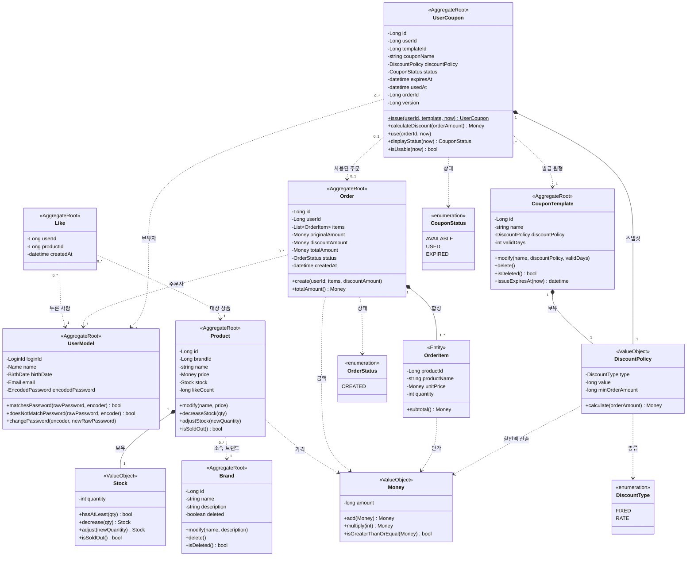
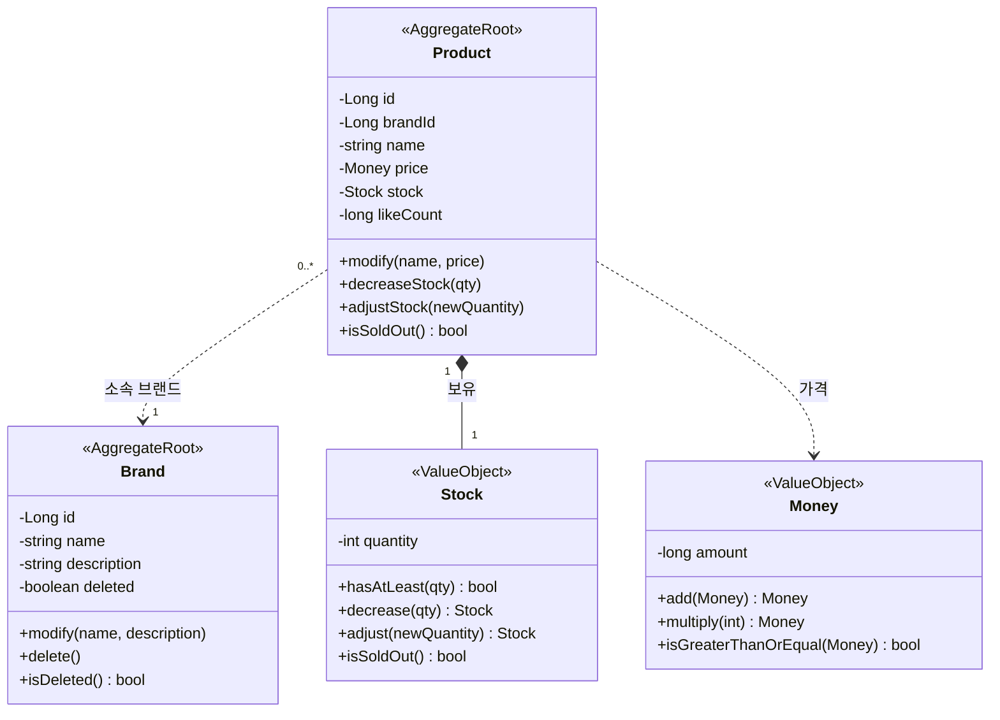
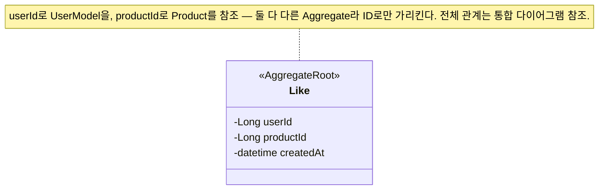
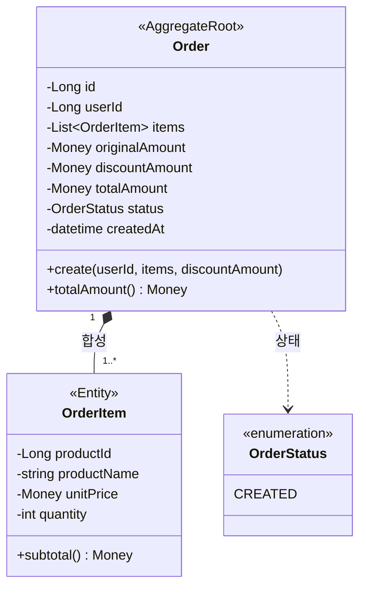
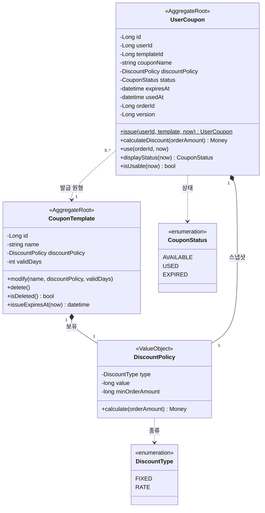

# 도메인 클래스 다이어그램

## 이 문서의 목적

요구사항(1단계)과 시퀀스(2단계)에 등장한 도메인을 **객체의 책임·관계**로 모델링한다. 검증하려는 것은 도메인 책임 / 의존 방향 / 응집도 세 가지다. 응용 서비스·Repository 같은 계층 객체는 도메인 행위가 아니므로 이 다이어그램에서 다루지 않는다 — 오케스트레이션·영속화 책임은 시퀀스 다이어그램(2단계)에서 본다.

문서는 **두 층**으로 본다 — 맨 위에 도메인 전체를 잇는 **통합 클래스 다이어그램** 하나를 두어 Aggregate 사이 참조를 조망하고, 그 아래에서 **도메인별로 쪼개** 각 영역의 객체를 자세히 설명한다.

## 한눈에 — Aggregate 7개

외부에서는 각 Aggregate의 대표 객체(Root)로만 접근한다.

| Aggregate | Root | 책임지는 핵심 불변식 |
|-----------|------|----------------------|
| 사용자 | `UserModel` | 로그인 ID는 유일하다. 식별·인증 정보는 모두 필수다. |
| 브랜드 | `Brand` | 브랜드명은 비어 있을 수 없다. 삭제는 논리 삭제(도메인 행위). |
| 상품 | `Product` | 가격·재고는 음수가 될 수 없다. 소속 브랜드는 바뀌지 않는다. |
| 좋아요 | `Like` | 한 사용자-상품 쌍에 좋아요는 최대 1개. |
| 주문 | `Order` | 최종 금액 = 적용 전 금액 − 할인액(≥ 0). 주문 이력은 불변. |
| 쿠폰 템플릿 | `CouponTemplate` | 할인 종류·값·유효일수가 유효 범위를 지킨다. 삭제는 논리 삭제. |
| 내 쿠폰 | `UserCoupon` | 한 사용자-템플릿 쌍에 쿠폰은 최대 1장. 사용 완료된 쿠폰은 재사용 불가. |

---

## 통합 클래스 다이어그램

도메인 전체를 한 그림으로 본다. `Money`는 여러 영역(`Product`·`OrderItem`·`Order`의 금액·`DiscountPolicy`의 할인액)이 공유하는 값 객체라 한 번만 정의하고 쓰는 쪽에서 참조한다.

**관계 읽는 법** — `*--`(합성)은 부모가 사라지면 자식도 사라지는 한 Aggregate 내부 관계(`Order`–`OrderItem`, `Product`–`Stock`). `..>`(의존)은 Aggregate 경계를 넘는 참조로, 객체 전체가 아니라 **ID로만** 가리킨다(`Like`·`Order` → `UserModel`·`Product`).

---

## 도메인별 상세

### 브랜드·상품 — `Brand` / `Product` / `Stock` / `Money`

- **`Brand`** (AggregateRoot) — 브랜드 정보 관리와 논리 삭제. `Brand` 는 곧 JPA 엔티티(`@Entity`, `BaseEntity` 상속)이며 `delete()`(BaseEntity) 가 `deletedAt` 을 set 한다(멱등). 도메인은 `isDeleted()`(= `deletedAt != null`) 로 삭제 여부를 노출하고, 삭제 시각은 `BaseEntity.deletedAt` 가 보관한다. 브랜드 삭제 시 소속 상품도 함께 삭제돼야 하는데, 이 연쇄는 `Brand` 한 Aggregate 경계를 넘으므로 도메인 서비스 또는 응용 계층이 조율한다(이 다이어그램 범위 밖).
- **`Product`** (AggregateRoot) — 재고를 보유. 주문 시 **재고 차감은 도메인 메서드 `decreaseStock(qty)`** 가 맡는다 — `Stock.hasAtLeast`로 충분성을 검증하고 부족하면 `BAD_REQUEST`, 충분하면 `Stock.decrease(qty)`로 새 `Stock`을 만든다. 응용 서비스는 주문 항목 스냅샷 때문에 어차피 상품을 조회하는데, 그 조회를 **비관적 쓰기 락**(`@Lock(PESSIMISTIC_WRITE)`)으로 잠가 로드하므로, in-memory 차감이라도 동시 주문이 같은 행 락에 직렬화되어 oversell이 나지 않는다(변경 감지로 커밋 시 UPDATE 반영, 4단계 ERD `products` 참조). 어드민이 재고를 특정 값으로 조정하는 것은 `adjustStock(newQuantity)`이 맡는다(US-15). `isSoldOut()`은 고객 응답의 '품절 여부'에 쓰인다. `modify()` 인자에 브랜드가 없는 것은 "브랜드 변경 불가" 규칙(AC-15-2)을 타입으로 막은 것이다. 좋아요 수는 `like_count`로 **비정규화**해 보유한다 — 진실은 `Like` 행이지만 좋아요순 정렬을 매번 `COUNT` 조인하면 데이터가 쌓일수록 느려져, 카운터를 두고 인덱스 정렬한다. 좋아요 수만은 in-memory 증감 메서드를 두지 않고(인기 상품 고경합) 응용 서비스가 `ProductRepository`의 **원자적 UPDATE**(`like_count ± 1`)로 증감하며, 행이 실제로 INSERT/DELETE 됐을 때만(영향 행 수 == 1) 호출한다 — 재고(비관 락)와 좋아요(원자 UPDATE)는 경합 정도가 달라 기법을 달리 했다(4단계 ERD `products` 참조).
- **`Stock`** (VO) — 재고 수량을 감싼 불변 값 객체. `adjust(newQuantity)`는 `newQuantity ≥ 0`일 때만 새 `Stock`을 돌려줘 `재고 ≥ 0` 불변식을 타입 안에서 지킨다. 주문 차감은 `hasAtLeast(qty)`로 `재고 ≥ 수량`을 확인한 뒤 `decrease(qty)`가 차감한 새 `Stock`을 돌려준다 — 이 read-modify-write가 동시 주문 사이에서 깨지지 않도록 하는 책임은 VO가 아니라 **호출 구간을 감싸는 비관적 행 락**(`Product` 로드 시 `@Lock(PESSIMISTIC_WRITE)`)에 있다. `isSoldOut()`은 고객 응답의 '품절 여부'에 쓰인다.
- **`Money`** (VO) — 금액과 그 계산 규칙(`add`·`multiply`·`isGreaterThanOrEqual`)을 캡슐화한 불변 값 객체. `Product.price`·`OrderItem.unitPrice`가 모두 이 타입이다. 단일 통화(원) 가정이라 통화 필드는 두지 않는다.
- **불변식** — 브랜드명은 필수. 상품의 가격 ≥ 0, 재고 ≥ 0. 상품의 소속 브랜드(`brandId`)는 생성 후 변경 불가.
- **삭제 정책** — 브랜드/상품 모두 논리 삭제. 엔티티는 `BaseEntity` 를 상속하므로 `delete()` 가 `deletedAt` 타임스탬프를 세팅하고, 도메인은 `isDeleted()`(= `deletedAt != null`) 로 상태를 노출한다(별도 `boolean deleted` 필드는 없음). Repository 의 일반 조회(`find`, `findAll`)는 쿼리에서 삭제 제외 필터(`deleted_at IS NULL`)를 유지해 의도하지 않은 노출을 막는다. 도메인 엔티티가 곧 JPA 엔티티이므로, 트랜잭션 안에서 `delete()` 호출 후 저장(`RepositoryImpl.update` → `save`/변경 감지)하면 `deletedAt` 이 반영된다(별도 Mapper 변환 없음).

### 좋아요 — `Like`

- **`Like`** (AggregateRoot) — 한 사용자가 한 상품을 좋아요한 사실. `(userId, productId)` 쌍이 곧 식별자다. 행동이 거의 없는, 의도적으로 얇은 Aggregate다.
- **불변식** — 한 (사용자, 상품) 쌍에 좋아요는 최대 1개. 멱등성은 등록 전 존재 확인과 DB 유일 제약이 함께 보장한다(2단계 시퀀스 다이어그램).
- **좋아요 수** — 따로 저장하지 않고 `Like` 행을 집계(`COUNT`)해 구한다(비정규화 컬럼 없음). 덕분에 좋아요 등록/취소는 `Like` 한 곳만 건드리는 단일 Aggregate 작업이다.

### 주문 — `Order` / `OrderItem` / `OrderStatus`

- **`Order`** (AggregateRoot) — 주문 한 건의 일관성. 항목·금액을 묶어 관리한다. `create(...)`로 주문 항목과 할인액을 받아 **적용 전 금액(항목 소계 합)·할인액·최종 금액**을 구성하며, 주문은 생성과 동시에 `CREATED` 상태가 된다 — 결제 단계가 없어 상태 전이가 없다. 주문자는 `userId`로 `UserModel`을 ID 참조한다. **`Order`는 쿠폰을 참조하지 않는다** — "얼마 할인됐는지"라는 결과 금액(`discountAmount`)만 보관하고, "어떤 쿠폰이 쓰였는지"는 알 필요가 없다. 쿠폰 사용 사실(어느 주문에서 썼는지)은 `UserCoupon`이 `orderId`로 단방향 보관한다(쿠폰 미사용 시 `discountAmount`는 0).
- **`OrderItem`** (값 컬렉션 요소) — 주문에 담긴 상품 1종과 수량. `productName`·`unitPrice`는 주문 시점 스냅샷(주문 이력)이라 이후 상품이 바뀌어도 불변. `productId`는 ID 참조 스냅샷으로 따로 보관한다. `Order` 없이는 존재하지 않으므로 합성 관계이며, 독립 정체성이 없어 식별자(`id`)를 두지 않는다 — 부분 취소·항목 단위 수정 같은 "항목을 단독으로 가리키는 행위"가 명세에 없어 식별자가 dead field 가 되기 때문이다. 매핑은 `@ElementCollection` + `@Embeddable OrderItem`(`@CollectionTable(name="order_items")`) 값 컬렉션으로, 대리키 없이 `order_id` 로 소속 주문에 종속된다. 부분 취소처럼 항목 단독 행위가 추가되는 시점에 별도 엔티티/도메인 id 도입을 검토한다.
- **금액 3종 스냅샷** — `originalAmount`(쿠폰 적용 전 항목 소계 합), `discountAmount`(할인액), `totalAmount`(최종 = original − discount)를 모두 주문에 저장한다. 할인 계산은 쿠폰(`UserCoupon.calculateDiscount`)이 책임지고, `Order`는 그 **결과 금액만 받아 보관**한다 — 주문은 쿠폰 도메인을 알 필요 없이 "얼마 할인됐는지"라는 값만 받는다. 영수증처럼 주문 시점 금액을 고정해, 이후 쿠폰·상품이 바뀌어도 주문 상세는 불변이다.
- **불변식** — 주문 항목은 1개 이상. 적용 전 금액 = 모든 항목 소계의 합. 할인액 ≤ 적용 전 금액, 최종 금액 ≥ 0. 주문 항목의 상품명·단가, 그리고 금액 3종은 주문 시점 스냅샷이며 생성 후 불변(주문 이력).

> **enum 한국어 대응** — `OrderStatus`: `CREATED`(주문 생성) — 결제·배송을 설계 범위에서 제외해 주문은 생성 후 상태 전이가 없는 단일 상태다.

### 쿠폰 — `CouponTemplate` / `UserCoupon` / `DiscountPolicy`

- **`CouponTemplate`** (AggregateRoot) — 어드민이 정의하는 쿠폰의 원형. 할인 정책(`DiscountPolicy`)과 유효일수(`validDays`)를 가진다. `issueExpiresAt(now)` = `now + validDays`로 발급될 쿠폰의 만료일을 계산해 준다. `Brand`처럼 논리 삭제(`BaseEntity.deletedAt`, `isDeleted()`)를 따른다. 템플릿 수정·삭제는 **이후 발급분에만** 영향을 주고, 이미 발급된 `UserCoupon`은 스냅샷이라 영향받지 않는다(AC-22-2·AC-23-2).
- **`UserCoupon`** (AggregateRoot) — 사용자가 발급받은 쿠폰 한 장. 발급 시 `issue(userId, template, now)`가 템플릿의 **할인 정책·쿠폰명을 복사(스냅샷)** 하고 만료일(`expiresAt = template.issueExpiresAt(now)`)을 확정한다. 템플릿은 `templateId`로 ID 참조만 하므로, 발급 이후 템플릿이 수정·삭제돼도 이 쿠폰의 가치는 변하지 않는다(`OrderItem`의 상품명·단가 스냅샷과 같은 원칙). `calculateDiscount(orderAmount)`는 스냅샷한 `DiscountPolicy`에 위임해 할인액을 구한다. `use(orderId, now)`는 사용 가능(미사용·미만료)일 때만 `USED`로 전이하고 `usedAt`·`orderId`를 기록하며, 위반 시 `CoreException`으로 거부한다(재사용·만료 사용 방지). 동시에 두 주문이 같은 쿠폰을 쓰는 **중복 사용**은 `version`(`@Version`) **낙관적 락**으로 막는다 — 저경합이라 커밋 시 충돌 검출이 가장 싸며, 충돌한 쪽은 주문 트랜잭션 전체가 롤백된다(`Product` 재고의 비관적 락과 대비 — 쿠폰은 저경합이라 무는 비용이 거의 없는 낙관 락을 택했다; 4단계 ERD 참조).
- **`DiscountPolicy`** (VO, `@Embeddable`) — 할인 종류(`type`)·값(`value`)과 사용 조건(`minOrderAmount`)을 묶고 **할인 계산 규칙을 캡슐화**한 불변 값 객체. `calculate(orderAmount)`는 먼저 적용 전 금액이 `minOrderAmount` 미만이면 `BAD_REQUEST`로 거부(주문 자체가 성립하지 않음, `0`이면 제한 없음)하고, 통과하면 `FIXED`면 `min(value, orderAmount)`(적용 전 금액을 넘지 않음), `RATE`면 `floor(orderAmount × value / 100)`(원 단위 절사)를 돌려준다. 어느 쪽도 적용 전 금액을 초과하지 않아 "최종 금액 ≥ 0" 불변식을 타입 안에서 지킨다. `minOrderAmount`는 사용 조건이지만 자기가 게이트하는 할인과 같은 VO에 두어, 같은 VO를 보유한 `CouponTemplate`(원형 정의)·`UserCoupon`(발급 스냅샷)에 별도 컬럼·복사 없이 함께 전파된다.
- **불변식** — 한 (사용자, 템플릿) 쌍에 쿠폰은 최대 1장(1인 1매). `FIXED` 값 ≥ 1(원), `RATE` 값은 1~100(%), 최소 주문 금액 ≥ 0(`0`=제한 없음), 유효일수 ≥ 1. 사용 완료(`USED`) 쿠폰은 다시 사용할 수 없다.
- **만료(`EXPIRED`) 판정** — 저장하는 상태는 `AVAILABLE`/`USED` 둘뿐이다. `EXPIRED`는 **저장하지 않고** `displayStatus(now)`가 "`AVAILABLE`이면서 `expiresAt`이 지난" 쿠폰을 조회 시점에 만료로 파생한다. 배치 없이 정확한 현재 상태를 보여주는 대신, "저장된 status"와 "노출 status"가 다를 수 있음을 감수한 선택이다.

> **enum 한국어 대응**
> - `DiscountType`: `FIXED`(정액·원), `RATE`(정률·%).
> - `CouponStatus`: `AVAILABLE`(사용 가능), `USED`(사용 완료), `EXPIRED`(만료) — `EXPIRED`는 조회 시점 파생값이며 저장되지 않는다.
