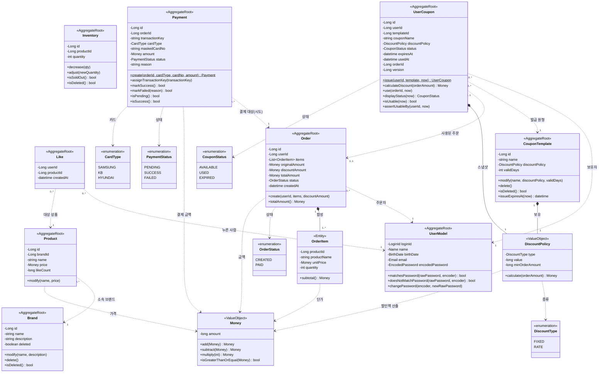
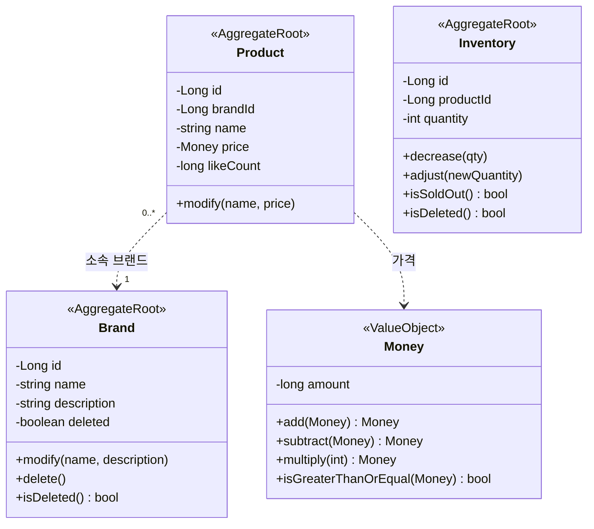
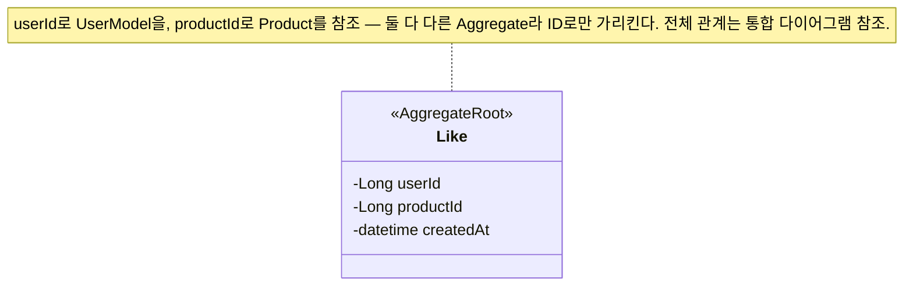
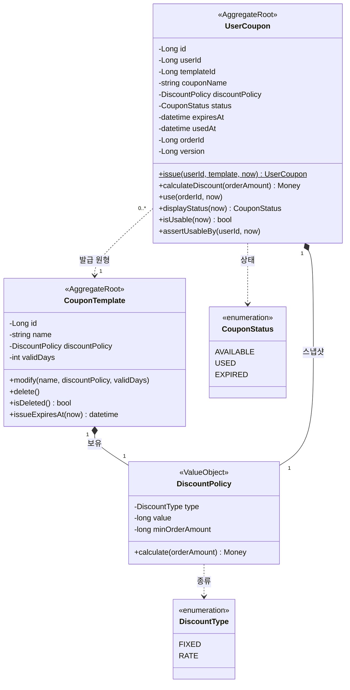
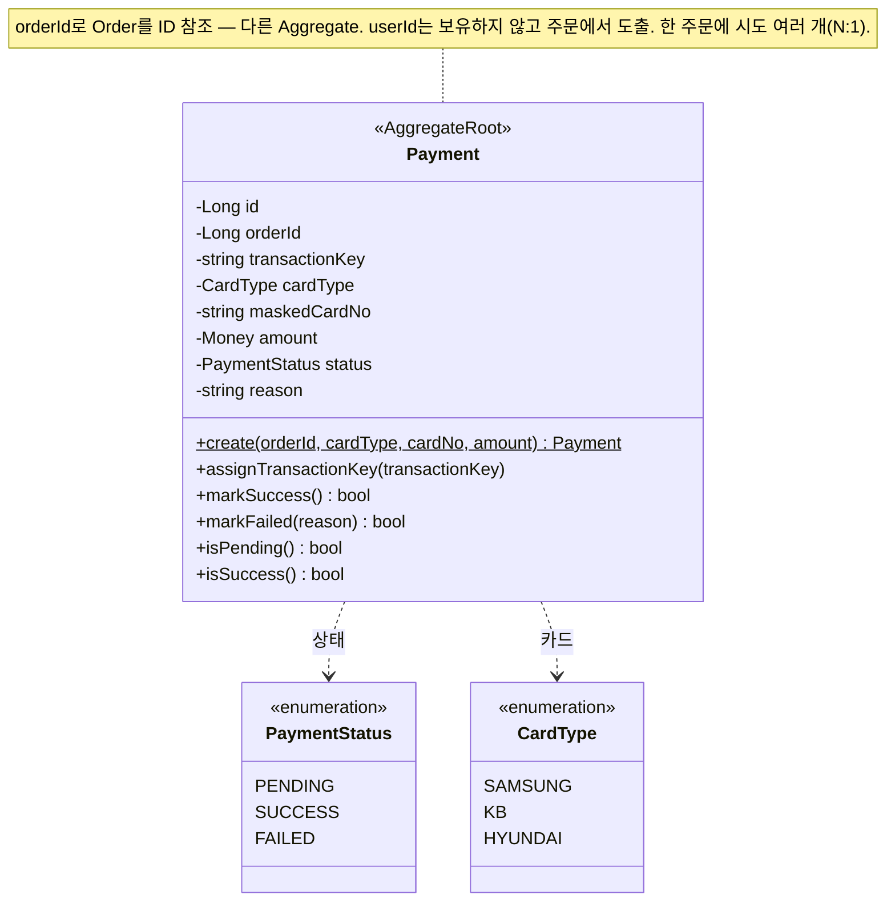

# 도메인 클래스 다이어그램

## 이 문서의 목적

요구사항(1단계)과 시퀀스(2단계)에 등장한 도메인을 **객체의 책임·관계**로 모델링한다. 검증하려는 것은 도메인 책임 / 의존 방향 / 응집도 세 가지다. 응용 서비스·Repository 같은 계층 객체는 도메인 행위가 아니므로 이 다이어그램에서 다루지 않는다 — 오케스트레이션·영속화 책임은 시퀀스 다이어그램(2단계)에서 본다.

문서는 **두 층**으로 본다 — 맨 위에 도메인 전체를 잇는 **통합 클래스 다이어그램** 하나를 두어 Aggregate 사이 참조를 조망하고, 그 아래에서 **도메인별로 쪼개** 각 영역의 객체를 자세히 설명한다.

## 한눈에 — Aggregate 9개

외부에서는 각 Aggregate의 대표 객체(Root)로만 접근한다.

| Aggregate | Root | 책임지는 핵심 불변식 |
|-----------|------|----------------------|
| 사용자 | `UserModel` | 로그인 ID는 유일하다. 식별·인증 정보는 모두 필수다. |
| 브랜드 | `Brand` | 브랜드명은 비어 있을 수 없다. 삭제는 논리 삭제(도메인 행위). |
| 상품 | `Product` | 가격은 음수가 될 수 없다. 소속 브랜드는 바뀌지 않는다. |
| 재고 | `Inventory` | 상품과 1:1(별도 애그리거트). 재고는 음수가 될 수 없다. |
| 좋아요 | `Like` | 한 사용자-상품 쌍에 좋아요는 최대 1개. |
| 주문 | `Order` | 최종 금액 = 적용 전 금액 − 할인액(≥ 0). 주문 이력은 불변. |
| 쿠폰 템플릿 | `CouponTemplate` | 할인 종류·값·유효일수가 유효 범위를 지킨다. 삭제는 논리 삭제. |
| 내 쿠폰 | `UserCoupon` | 한 사용자-템플릿 쌍에 쿠폰은 최대 1장. 사용 완료된 쿠폰은 재사용 불가. |
| 결제 | `Payment` | 한 주문에 여러 시도(N:1). 종결(`SUCCESS`/`FAILED`) 상태는 다시 전이하지 않는다(멱등). 같은 주문의 동시 결제는 주문 행 비관락으로 직렬화한다. |

---

## 통합 클래스 다이어그램

도메인 전체를 한 그림으로 본다. `Money`는 여러 영역(`Product`·`OrderItem`·`Order`의 금액·`DiscountPolicy`의 할인액)이 공유하는 값 객체라 한 번만 정의하고 쓰는 쪽에서 참조한다.

**관계 읽는 법** — `*--`(합성)은 부모가 사라지면 자식도 사라지는 한 Aggregate 내부 관계(`Order`–`OrderItem`). `..>`(의존)은 Aggregate 경계를 넘는 참조로, 객체 전체가 아니라 **ID로만** 가리킨다(`Like`·`Order` → `UserModel`·`Product`, `Inventory` → `Product`, `Payment` → `Order`). 한 주문에 결제 **시도**가 여러 개일 수 있어 `Payment`–`Order`는 N:1이며, 주문은 결제를 역참조하지 않는다(쿠폰처럼 단방향). `Payment`는 `userId`를 보유하지 않고 결제자를 `orderId → Order.userId`로 도출한다.

---

## 도메인별 상세

### 브랜드·상품·재고 — `Brand` / `Product` / `Inventory` / `Money`

- **`Brand`** (AggregateRoot) — 브랜드 정보 관리와 논리 삭제. `Brand` 는 곧 JPA 엔티티(`@Entity`, `BaseEntity` 상속)이며 `delete()`(BaseEntity) 가 `deletedAt` 을 set 한다(멱등). 도메인은 `isDeleted()`(= `deletedAt != null`) 로 삭제 여부를 노출하고, 삭제 시각은 `BaseEntity.deletedAt` 가 보관한다. 브랜드 삭제 시 소속 상품도 함께 삭제돼야 하는데, 이 연쇄는 `Brand` 한 Aggregate 경계를 넘으므로 도메인 서비스 또는 응용 계층이 조율한다(이 다이어그램 범위 밖).
- **`Product`** (AggregateRoot) — 상품 식별·가격·이름과 좋아요 카운터를 보유하되 **재고는 보유하지 않는다**(별도 `Inventory` 애그리거트로 분리). `modify()` 인자에 브랜드가 없는 것은 "브랜드 변경 불가" 규칙(AC-15-2)을 타입으로 막은 것이다. 좋아요 수는 `like_count`로 **비정규화**해 보유한다 — 진실은 `Like` 행이지만 좋아요순 정렬을 매번 `COUNT` 조인하면 데이터가 쌓일수록 느려져, 카운터를 두고 인덱스 정렬한다. 좋아요 수는 in-memory 증감 메서드를 두지 않고(인기 상품 고경합) 응용 서비스가 `ProductRepository`의 **원자적 UPDATE**(`like_count ± 1`)로 증감하며, 행이 실제로 INSERT/DELETE 됐을 때만(영향 행 수 == 1) 호출한다.
- **`Inventory`** (AggregateRoot) — 상품의 가용 재고를 **독립 애그리거트**로 관리한다(`productId`로 상품을 ID 참조, 1:1). 수량(`quantity`)은 단일 값이라 별도 VO 로 감싸지 않고 애그리거트가 직접 보유하며, `재고 ≥ 0` 불변식과 차감 규칙을 자기 안에서 지킨다. 주문 시 **재고 차감은 `decrease(qty)`** 가 맡는다 — `재고 ≥ 수량`을 검증하고 부족하면 `BAD_REQUEST`, 충분하면 차감한다. 응용 서비스는 차감 대상 `Inventory` 행을 **비관적 쓰기 락**(`@Lock(PESSIMISTIC_WRITE)`, product_id 오름차순)으로 잠가 로드하므로 동시 주문이 같은 행 락에 직렬화되어 oversell이 나지 않는다(변경 감지로 커밋 시 UPDATE 반영, 4단계 ERD `inventories` 참조). 이 read-modify-write가 동시 주문 사이에서 깨지지 않도록 하는 책임은 도메인 객체가 아니라 **호출 구간을 감싸는 비관적 행 락**에 있다. 어드민의 재고 절대값 조정은 `adjust(newQuantity)`(US-15), 품절 여부는 `isSoldOut()`. **재고를 `products`에서 떼어낸 이유**는 주문 비관락(행 장기 보유)과 좋아요 원자 UPDATE가 같은 `products` 행 락을 두고 다투는 false sharing을 없애기 위함이다(상세는 4단계 ERD `inventories`). 상품 조회(상세·목록)는 `Inventory`를 배치 조회해 재고·품절을 합성한다. 상품이 삭제되면 그 `Inventory`도 **함께 소프트 삭제**되어(개별·브랜드 일괄 모두), 주문의 락 조회(`deleted_at IS NULL`)에서 빠진다 — 삭제와 주문이 같은 재고 행 락에 직렬화돼 "삭제된 상품 주문" 경쟁이 차단된다(상세는 4단계 ERD `inventories`).
- **`Money`** (VO) — 금액과 그 계산 규칙(`add`·`subtract`·`multiply`·`isGreaterThanOrEqual`)을 캡슐화한 불변 값 객체. `Product.price`·`OrderItem.unitPrice`가 모두 이 타입이다. 단일 통화(원) 가정이라 통화 필드는 두지 않는다.
- **불변식** — 브랜드명은 필수. 상품의 가격 ≥ 0, 재고(`Inventory`) ≥ 0. 상품의 소속 브랜드(`brandId`)는 생성 후 변경 불가.
- **삭제 정책** — 브랜드/상품 모두 논리 삭제. 엔티티는 `BaseEntity` 를 상속하므로 `delete()` 가 `deletedAt` 타임스탬프를 세팅하고, 도메인은 `isDeleted()`(= `deletedAt != null`) 로 상태를 노출한다(별도 `boolean deleted` 필드는 없음). Repository 의 일반 조회(`find`, `findAll`)는 쿼리에서 삭제 제외 필터(`deleted_at IS NULL`)를 유지해 의도하지 않은 노출을 막는다. 도메인 엔티티가 곧 JPA 엔티티이므로, 트랜잭션 안에서 `delete()` 호출 후 저장(`RepositoryImpl.update` → `save`/변경 감지)하면 `deletedAt` 이 반영된다(별도 Mapper 변환 없음).

### 좋아요 — `Like`

- **`Like`** (AggregateRoot) — 한 사용자가 한 상품을 좋아요한 사실. `(userId, productId)` 쌍이 곧 식별자다. 행동이 거의 없는, 의도적으로 얇은 Aggregate다.
- **불변식** — 한 (사용자, 상품) 쌍에 좋아요는 최대 1개. 멱등성은 등록 전 존재 확인과 DB 유일 제약이 함께 보장한다(2단계 시퀀스 다이어그램).
- **좋아요 수** — 진실은 `Like` 행이지만, 좋아요순 정렬 성능을 위해 다른 Aggregate 인 `Product.like_count` 로 **비정규화**해 보유한다(종속 카운터). 좋아요 등록/취소는 `Like` 행을 INSERT/DELETE 하고, 행이 **실제로** 생기거나 사라질 때만(영향 행 수 == 1) 그 카운터를 원자적으로 증감한다 — 표시/정렬은 카운터를 읽고 `COUNT` 집계를 돌리지 않는다(ERD `products`/`product_likes` 참조).

### 주문 — `Order` / `OrderItem` / `OrderStatus`

- **`Order`** (AggregateRoot) — 주문 한 건의 일관성. 항목·금액을 묶어 관리한다. `create(...)`로 주문 항목과 할인액을 받아 **적용 전 금액(항목 소계 합)·할인액·최종 금액**을 구성하며, 주문은 생성과 동시에 `CREATED` 상태가 된다. 결제가 성공하면(연결된 `Payment` SUCCESS 콜백) `pay()`로 **`CREATED`→`PAID`** 로 전이한다(Round 6). 결제 실패는 주문을 `CREATED`로 유지해 재결제를 허용한다. 주문자는 `userId`로 `UserModel`을 ID 참조한다. **`Order`는 `Payment`를 역참조하지 않는다** — 쿠폰과 같은 원칙으로, "결제됐는지(`PAID`)"라는 상태만 갖고 "어느 시도로 결제됐는지"는 `Payment`가 `orderId`로 단방향 보관한다(현재 유효 결제 = 최신 시도, 조회로 도출). **`Order`는 쿠폰을 참조하지 않는다** — "얼마 할인됐는지"라는 결과 금액(`discountAmount`)만 보관하고, "어떤 쿠폰이 쓰였는지"는 알 필요가 없다. 쿠폰 사용 사실(어느 주문에서 썼는지)은 `UserCoupon`이 `orderId`로 단방향 보관한다(쿠폰 미사용 시 `discountAmount`는 0).
- **`OrderItem`** (값 컬렉션 요소) — 주문에 담긴 상품 1종과 수량. `productName`·`unitPrice`는 주문 시점 스냅샷(주문 이력)이라 이후 상품이 바뀌어도 불변. `productId`는 ID 참조 스냅샷으로 따로 보관한다. `Order` 없이는 존재하지 않으므로 합성 관계이며, 독립 정체성이 없어 식별자(`id`)를 두지 않는다 — 부분 취소·항목 단위 수정 같은 "항목을 단독으로 가리키는 행위"가 명세에 없어 식별자가 dead field 가 되기 때문이다. 매핑은 `@ElementCollection` + `@Embeddable OrderItem`(`@CollectionTable(name="order_items")`) 값 컬렉션으로, 대리키 없이 `order_id` 로 소속 주문에 종속된다. 부분 취소처럼 항목 단독 행위가 추가되는 시점에 별도 엔티티/도메인 id 도입을 검토한다.
- **금액 3종 스냅샷** — `originalAmount`(쿠폰 적용 전 항목 소계 합), `discountAmount`(할인액), `totalAmount`(최종 = original − discount)를 모두 주문에 저장한다. 할인 계산은 쿠폰(`UserCoupon.calculateDiscount`)이 책임지고, `Order`는 그 **결과 금액만 받아 보관**한다 — 주문은 쿠폰 도메인을 알 필요 없이 "얼마 할인됐는지"라는 값만 받는다. 영수증처럼 주문 시점 금액을 고정해, 이후 쿠폰·상품이 바뀌어도 주문 상세는 불변이다.
- **불변식** — 주문 항목은 1개 이상. 적용 전 금액 = 모든 항목 소계의 합. 할인액 ≤ 적용 전 금액, 최종 금액 ≥ 0. 주문 항목의 상품명·단가, 그리고 금액 3종은 주문 시점 스냅샷이며 생성 후 불변(주문 이력).

> **enum 한국어 대응** — `OrderStatus`: `CREATED`(주문 생성), `PAID`(결제 완료). 결제 성공 콜백 시 `CREATED`→`PAID`로 전이한다(Round 6). 배송 등 이후 단계는 설계 범위 밖.

### 쿠폰 — `CouponTemplate` / `UserCoupon` / `DiscountPolicy`

- **`CouponTemplate`** (AggregateRoot) — 어드민이 정의하는 쿠폰의 원형. 할인 정책(`DiscountPolicy`)과 유효일수(`validDays`)를 가진다. `issueExpiresAt(now)` = `now + validDays`로 발급될 쿠폰의 만료일을 계산해 준다. `Brand`처럼 논리 삭제(`BaseEntity.deletedAt`, `isDeleted()`)를 따른다. 템플릿 수정·삭제는 **이후 발급분에만** 영향을 주고, 이미 발급된 `UserCoupon`은 스냅샷이라 영향받지 않는다(AC-22-2·AC-23-2).
- **`UserCoupon`** (AggregateRoot) — 사용자가 발급받은 쿠폰 한 장. 발급 시 `issue(userId, template, now)`가 템플릿의 **할인 정책·쿠폰명을 복사(스냅샷)** 하고 만료일(`expiresAt = template.issueExpiresAt(now)`)을 확정한다. 템플릿은 `templateId`로 ID 참조만 하므로, 발급 이후 템플릿이 수정·삭제돼도 이 쿠폰의 가치는 변하지 않는다(`OrderItem`의 상품명·단가 스냅샷과 같은 원칙). `calculateDiscount(orderAmount)`는 스냅샷한 `DiscountPolicy`에 위임해 할인액을 구한다. `assertUsableBy(userId, now)`는 본인 소유·사용 가능(미사용·미만료) 여부를 검증해 위반 시 `CoreException`(FORBIDDEN/BAD_REQUEST)으로 거부하는데 — 주문 흐름은 이를 **재고 비관락보다 앞서** 호출해 무효 쿠폰이 핫 로우 락을 점유하지 않게 한다(fail-cheap-first, 2단계 시퀀스). `use(orderId, now)`는 사용 가능(미사용·미만료)일 때만 `USED`로 전이하고 `usedAt`·`orderId`를 기록하며, 위반 시 `CoreException`으로 거부한다(재사용·만료 사용 방지). 동시에 두 주문이 같은 쿠폰을 쓰는 **중복 사용**은 `version`(`@Version`) **낙관적 락**으로 막는다 — 저경합이라 커밋 시 충돌 검출이 가장 싸며, 충돌한 쪽은 주문 트랜잭션 전체가 롤백된다(재고(`Inventory`)의 비관적 락과 대비 — 쿠폰은 저경합이라 무는 비용이 거의 없는 낙관 락을 택했다; 4단계 ERD 참조).
- **`DiscountPolicy`** (VO, `@Embeddable`) — 할인 종류(`type`)·값(`value`)과 사용 조건(`minOrderAmount`)을 묶고 **할인 계산 규칙을 캡슐화**한 불변 값 객체. `calculate(orderAmount)`는 먼저 적용 전 금액이 `minOrderAmount` 미만이면 `BAD_REQUEST`로 거부(주문 자체가 성립하지 않음, `0`이면 제한 없음)하고, 통과하면 `FIXED`면 `min(value, orderAmount)`(적용 전 금액을 넘지 않음), `RATE`면 `floor(orderAmount × value / 100)`(원 단위 절사)를 돌려준다. 어느 쪽도 적용 전 금액을 초과하지 않아 "최종 금액 ≥ 0" 불변식을 타입 안에서 지킨다. `minOrderAmount`는 사용 조건이지만 자기가 게이트하는 할인과 같은 VO에 두어, 같은 VO를 보유한 `CouponTemplate`(원형 정의)·`UserCoupon`(발급 스냅샷)에 별도 컬럼·복사 없이 함께 전파된다.
- **불변식** — 한 (사용자, 템플릿) 쌍에 쿠폰은 최대 1장(1인 1매). `FIXED` 값 ≥ 1(원), `RATE` 값은 1~100(%), 최소 주문 금액 ≥ 0(`0`=제한 없음), 유효일수 ≥ 1. 사용 완료(`USED`) 쿠폰은 다시 사용할 수 없다.
- **만료(`EXPIRED`) 판정** — 저장하는 상태는 `AVAILABLE`/`USED` 둘뿐이다. `EXPIRED`는 **저장하지 않고** `displayStatus(now)`가 "`AVAILABLE`이면서 `expiresAt`이 지난" 쿠폰을 조회 시점에 만료로 파생한다. 배치 없이 정확한 현재 상태를 보여주는 대신, "저장된 status"와 "노출 status"가 다를 수 있음을 감수한 선택이다.

> **enum 한국어 대응**
> - `DiscountType`: `FIXED`(정액·원), `RATE`(정률·%).
> - `CouponStatus`: `AVAILABLE`(사용 가능), `USED`(사용 완료), `EXPIRED`(만료) — `EXPIRED`는 조회 시점 파생값이며 저장되지 않는다.

### 결제 — `Payment` / `PaymentStatus` / `CardType` (Round 6)

- **`Payment`** (AggregateRoot) — **한 번의 결제 시도**를 표현한다. 한 주문에 시도가 여러 개일 수 있어(`orderId`로 `Order`를 ID 참조, **N:1**), 실패 후 카드를 바꿔 재결제하면 같은 주문에 **새 `Payment`** 가 생긴다(주문당 1건이 아니라 **시도당 1건** — 종결된 시도를 되살리는 대신 새 시도를 만들어, 전이 가드와 재시도가 충돌하지 않는다). `userId`는 보유하지 않는다 — 결제 주체는 `orderId → Order.userId`로 도출되는 파생값이라 스냅샷 의미가 없다(반면 금액은 결제 시점 박제라 보유). 생성은 `create(...)`로 `PENDING` 상태가 되고, PG 접수 응답을 받으면 `assignTransactionKey(transactionKey)`로 거래키만 저장하되 **여전히 `PENDING`** 이다(접수≠결과). 결과 확정은 `markSuccess()`/`markFailed(reason)`이 하며, 둘 다 **`PENDING`에서만** 전이하고 종결(`SUCCESS`/`FAILED`) 상태에서는 무시하고 `false`를 반환한다(`isTerminal()` 가드) — 콜백 중복(at-least-once)·콜백과 정산의 동시 종결을 이 값-멱등 no-op 가드가 흡수한다(전이가 실제 일어났을 때만 `order.pay()`). **금액(`amount`)은 결제 요청 시점 주문 최종 금액의 스냅샷**으로, `Money` VO를 공유한다.
- **이중결제(따닥) 차단** — 같은 주문에 대한 동시 결제 요청은 **주문 행 비관락(FOR UPDATE)** 으로 직렬화한다. 응용은 예약 트랜잭션에서 주문을 잠그고 "살아있는 시도(`PENDING`·`SUCCESS`)가 있으면 차단" + `PENDING` 저장을 한 번에 처리한다(검사+삽입 원자화 → `if 존재? 차단 : 생성`의 동시성 창 제거). 락은 PG 호출 **전에** 해제한다. `FAILED`만 있으면 정당한 재시도로 보고 허용한다. cf. 멱등키(클라이언트 발급 키 + 유니크) 대신 비관락을 택한 이유 — orderId가 이미 자연 키라 새 식별자/클라이언트 계약이 불필요하고, 외부 청구가 트랜잭션 한가운데 있는 형태라 "호출 전 직렬화"가 필요하기 때문(낙관락은 commit 시점=청구 이후 감지라 부적합).
- **`transactionKey`** — PG가 접수 시 부여하는 거래 식별자(nullable). 현재 콜백/정산의 결제 매칭은 이 키로 한다. 요청 타임아웃이면 이 응답이 유실될 수 있는데(in-doubt), 그 경우 키가 없어 매칭이 안 되므로 `orderId` 상관키 매칭은 후속 하드닝으로 남긴다(2단계 시퀀스 4-2·4-3).
- **불변식** — 한 결제의 상태 전이는 `PENDING → SUCCESS` 또는 `PENDING → FAILED` 단방향이며 종결 상태는 불변이다. `FAILED`는 사유(`reason`, 자유 문자열)를 가진다. 금액 ≥ 0.
- **상태가 어긋날 수 있음(내부↔PG)** — `PENDING`은 "처리 중"과 "타임아웃으로 모름"을 함께 흡수한다(별도 `UNKNOWN` 상태를 두지 않아 상태 폭발을 막음). "타임아웃→`FAILED`" 단정을 하지 않는 것이 (내부=실패, PG=승인) 조합을 구조적으로 막는 핵심이다(2단계 시퀀스 4-3 어긋남 표).

> **enum 한국어 대응**
> - `PaymentStatus`: `PENDING`(접수·대기 = 처리중 + 타임아웃으로 모름), `SUCCESS`(승인), `FAILED`(실패).
> - 실패 사유는 별도 enum 없이 `reason`(자유 문자열)으로 보관한다(PG가 내려준 사유를 그대로 기록).
> - `CardType`: 카드사(예: `SAMSUNG`/`KB`/`HYUNDAI`) — pg-simulator가 받는 카드 종류에 맞춘다.

> **기법 선택(결제 동시성)** — 결제는 ⓐ 요청 중복(따닥)을 **주문 행 비관락**(예약 시 FOR UPDATE로 검사+삽입 직렬화, PG 호출 전 해제)으로, ⓑ 콜백 중복·콜백↔정산 경쟁을 **종결 no-op 가드**(값-멱등 전이 + 실제 전이 시에만 `order.pay()`)로 막는다. 재고(비관 락)·쿠폰(낙관 락)·좋아요(원자 UPDATE)에 이어, 결제 ⓑ는 **"외부 시스템과의 멱등"** 이라 결이 또 다르다 — 경합 상대가 내부 트랜잭션이 아니라 *재전송·중복 통지*이기 때문이다. 지금은 `order.pay()`가 순수 상태 전이라 ⓑ에 별도 락이 불필요하지만, `PAID`에 부작용이 붙으면 그때 낙관락(`@Version`)을 도입한다(현재 미적용). cf. ⓐ에서 멱등키(클라이언트 키 유니크) 대신 비관락을 택했다 — orderId가 이미 자연 키이고, 외부 청구가 트랜잭션 한가운데 있어 "호출 전 직렬화"가 필요하기 때문(낙관락은 commit=청구 이후 감지라 부적합).
