# 이커머스 DB 스키마 (ERD)

## ERD

```mermaid
erDiagram
    users ||--o{ likes : "누른다"
    users ||--o{ orders : "주문한다"
    brands ||--o{ products : "보유한다"
    products ||--o{ likes : "대상이 된다"
    products ||--o{ order_items : "담긴다"
    orders ||--|{ order_items : "포함한다"

    users {
        bigint id PK
        varchar(50) login_id UK "NOT NULL"
        varchar(100) name "NOT NULL"
        date birth_date "NOT NULL"
        varchar(255) email "NOT NULL"
        varchar(255) encoded_password "NOT NULL"
        timestamp deleted_at "NULL"
        timestamp created_at "NOT NULL"
        timestamp updated_at "NOT NULL"
    }

    brands {
        bigint id PK
        varchar(100) name "NOT NULL"
        varchar(500) description "NULL"
        timestamp deleted_at "NULL / soft delete"
        timestamp created_at "NOT NULL"
        timestamp updated_at "NOT NULL"
    }

    products {
        bigint id PK
        bigint brand_id FK "NOT NULL"
        varchar(200) name "NOT NULL"
        bigint price "NOT NULL / CHECK >= 0 / 원"
        int stock_quantity "NOT NULL / CHECK >= 0"
        timestamp deleted_at "NULL / soft delete"
        timestamp created_at "NOT NULL"
        timestamp updated_at "NOT NULL"
    }

    likes {
        bigint user_id PK, FK "NOT NULL"
        bigint product_id PK, FK "NOT NULL"
        timestamp created_at "NOT NULL"
    }

    orders {
        bigint id PK
        bigint user_id FK "NOT NULL"
        varchar(20) status "NOT NULL / COMPLETED"
        bigint total_amount "NOT NULL / CHECK >= 0 / 원"
        timestamp created_at "NOT NULL / 주문 시각"
        timestamp updated_at "NOT NULL"
    }

    order_items {
        bigint id PK
        bigint order_id FK "NOT NULL"
        bigint product_id FK "NOT NULL"
        varchar(200) product_name "NOT NULL / 주문 시점 스냅샷"
        bigint unit_price "NOT NULL / CHECK >= 0 / 주문 시점 스냅샷 / 원"
        int quantity "NOT NULL / CHECK > 0"
        timestamp created_at "NOT NULL"
        timestamp updated_at "NOT NULL"
    }
```

---

## 테이블 상세

### 사용자 — `users`

| 컬럼 | 타입 | 제약 | 설명 |
|------|------|------|------|
| id | BIGINT | PK, IDENTITY | 대리키 |
| login_id | VARCHAR(50) | UNIQUE, NOT NULL | 로그인 식별자 |
| name | VARCHAR(100) | NOT NULL | 이름 |
| birth_date | DATE | NOT NULL | 생년월일 |
| email | VARCHAR(255) | NOT NULL | 이메일 |
| encoded_password | VARCHAR(255) | NOT NULL | 암호화된 비밀번호 |
| deleted_at | TIMESTAMP | NULL | 삭제 시각 |
| created_at | TIMESTAMP | NOT NULL | 생성 시각 |
| updated_at | TIMESTAMP | NOT NULL | 수정 시각 |

### 브랜드 — `brands`

| 컬럼 | 타입 | 제약 | 설명 |
|------|------|------|------|
| id | BIGINT | PK, IDENTITY | 대리키 |
| name | VARCHAR(100) | NOT NULL | 브랜드명 |
| description | VARCHAR(500) | NULL | 브랜드 소개 |
| deleted_at | TIMESTAMP | NULL | 삭제 시각 |
| created_at | TIMESTAMP | NOT NULL | 생성 시각 |
| updated_at | TIMESTAMP | NOT NULL | 수정 시각 |

### 상품 — `products`

| 컬럼 | 타입 | 제약 | 설명 |
|------|------|------|------|
| id | BIGINT | PK, IDENTITY | 대리키 |
| brand_id | BIGINT | FK→brands.id, NOT NULL | 소속 브랜드 |
| name | VARCHAR(200) | NOT NULL | 상품명 |
| price | BIGINT | NOT NULL, CHECK (price >= 0) | 판매가(원) |
| stock_quantity | INTEGER | NOT NULL, CHECK (stock_quantity >= 0) | 재고 수량 |
| deleted_at | TIMESTAMP | NULL | 삭제 시각 |
| created_at | TIMESTAMP | NOT NULL | 생성 시각 |
| updated_at | TIMESTAMP | NOT NULL | 수정 시각 |

### 좋아요 — `likes`

| 컬럼 | 타입 | 제약 | 설명 |
|------|------|------|------|
| user_id | BIGINT | PK, FK→users.id | 좋아요한 사용자 |
| product_id | BIGINT | PK, FK→products.id | 좋아요 대상 상품 |
| created_at | TIMESTAMP | NOT NULL | 좋아요한 시각 |

**제약** — 복합 기본키 `(user_id, product_id)`: 한 사용자가 한 상품에 좋아요는 최대 1개 — 이 PK가 **멱등성의 최종 방어선**이다(애플리케이션의 존재 확인이 동시성으로 뚫려도 DB가 막는다 — 2단계 시퀀스 다이어그램). 좋아요 취소는 행을 **물리 삭제**한다. `id`·`updated_at`을 두지 않는다 — `(user_id, product_id)`가 곧 식별자이고, 한 번 누른 좋아요는 수정되지 않는 불변 행이다(3단계 클래스 다이어그램 `Like`와 일치).

### 주문 — `orders`

| 컬럼 | 타입 | 제약 | 설명 |
|------|------|------|------|
| id | BIGINT | PK, IDENTITY | 대리키 |
| user_id | BIGINT | FK→users.id, NOT NULL | 주문자 |
| status | VARCHAR(20) | NOT NULL, DEFAULT 'COMPLETED', CHECK (status = 'COMPLETED') | 주문 상태 |
| total_amount | BIGINT | NOT NULL, CHECK (total_amount >= 0) | 주문 총액(원) |
| created_at | TIMESTAMP | NOT NULL | 주문 시각 |
| updated_at | TIMESTAMP | NOT NULL | 수정 시각 |

### 주문 항목 — `order_items`

| 컬럼 | 타입 | 제약 | 설명 |
|------|------|------|------|
| id | BIGINT | PK, IDENTITY | 대리키 |
| order_id | BIGINT | FK→orders.id, NOT NULL | 소속 주문 |
| product_id | BIGINT | FK→products.id, NOT NULL | 참조 상품 |
| product_name | VARCHAR(200) | NOT NULL | 상품명 (주문 시점 스냅샷) |
| unit_price | BIGINT | NOT NULL, CHECK (unit_price >= 0) | 단가 (주문 시점 스냅샷, 원) |
| quantity | INTEGER | NOT NULL, CHECK (quantity > 0) | 주문 수량 |
| created_at | TIMESTAMP | NOT NULL | 생성 시각 |
| updated_at | TIMESTAMP | NOT NULL | 수정 시각 |
