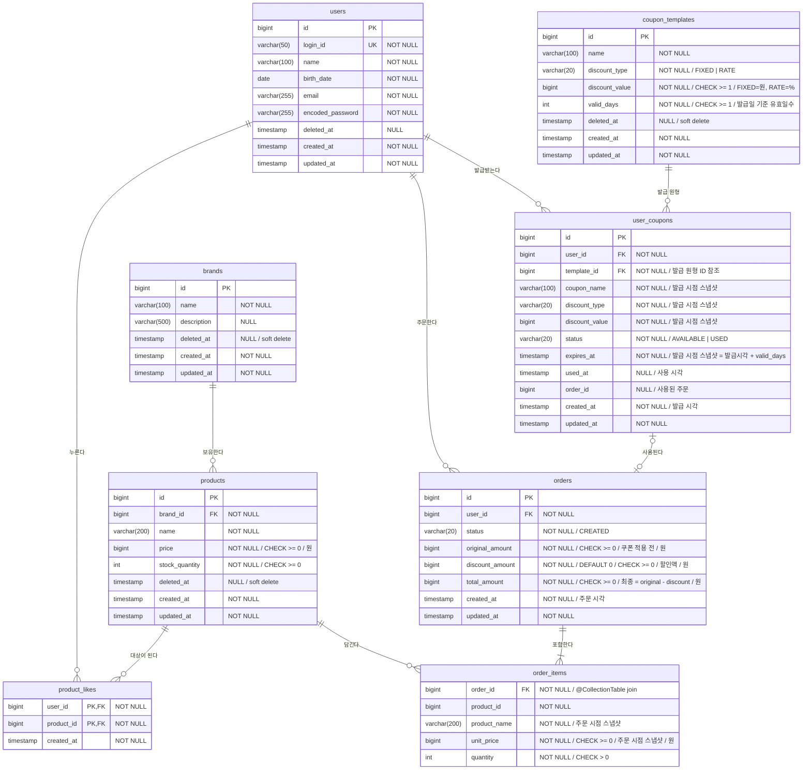

# 이커머스 DB 스키마 (ERD)

## ERD

> `order_items` 는 `Order` 애그리거트 내부의 값 컬렉션(`@ElementCollection` + `@Embeddable OrderItem`)으로 매핑된다.
> 독립 정체성이 없는 주문 시점 스냅샷이므로 대리키(`id`)와 감사 컬럼(`created_at`/`updated_at`)을 두지 않고, `order_id` 로 소속 주문에 종속된다.

---

## 테이블 상세

### 사용자 — `users`

| 컬럼 | 타입 | 제약 | 설명 |
|------|------|------|------|
| id | BIGINT | PK, IDENTITY | 대리키 |
| login_id | VARCHAR(50) | UNIQUE, NOT NULL | 로그인 식별자 |
| name | VARCHAR(100) | NOT NULL | 이름 |
| birth_date | DATE | NOT NULL | 생년월일 |
| email | VARCHAR(255) | NOT NULL | 이메일 |
| encoded_password | VARCHAR(255) | NOT NULL | 암호화된 비밀번호 |
| deleted_at | TIMESTAMP | NULL | 삭제 시각 |
| created_at | TIMESTAMP | NOT NULL | 생성 시각 |
| updated_at | TIMESTAMP | NOT NULL | 수정 시각 |

### 브랜드 — `brands`

| 컬럼 | 타입 | 제약 | 설명 |
|------|------|------|------|
| id | BIGINT | PK, IDENTITY | 대리키 |
| name | VARCHAR(100) | NOT NULL | 브랜드명 |
| description | VARCHAR(500) | NULL | 브랜드 소개 |
| deleted_at | TIMESTAMP | NULL | 삭제 시각 |
| created_at | TIMESTAMP | NOT NULL | 생성 시각 |
| updated_at | TIMESTAMP | NOT NULL | 수정 시각 |

### 상품 — `products`

| 컬럼 | 타입 | 제약 | 설명 |
|------|------|------|------|
| id | BIGINT | PK, IDENTITY | 대리키 |
| brand_id | BIGINT | FK→brands.id, NOT NULL | 소속 브랜드 |
| name | VARCHAR(200) | NOT NULL | 상품명 |
| price | BIGINT | NOT NULL, CHECK (price >= 0) | 판매가(원) |
| stock_quantity | INTEGER | NOT NULL, CHECK (stock_quantity >= 0) | 재고 수량 |
| deleted_at | TIMESTAMP | NULL | 삭제 시각 |
| created_at | TIMESTAMP | NOT NULL | 생성 시각 |
| updated_at | TIMESTAMP | NOT NULL | 수정 시각 |

### 좋아요 — `product_likes`

| 컬럼 | 타입 | 제약 | 설명 |
|------|------|------|------|
| user_id | BIGINT | PK, FK→users.id | 좋아요한 사용자 |
| product_id | BIGINT | PK, FK→products.id | 좋아요 대상 상품 |
| created_at | TIMESTAMP | NOT NULL | 좋아요한 시각 |

**제약** — 복합 기본키 `(user_id, product_id)`: 한 사용자가 한 상품에 좋아요는 최대 1개 — 이 PK가 **멱등성의 최종 방어선**이다(애플리케이션의 존재 확인이 동시성으로 뚫려도 DB가 막는다 — 2단계 시퀀스 다이어그램). 좋아요 취소는 행을 **물리 삭제**한다. `id`·`updated_at`을 두지 않는다 — `(user_id, product_id)`가 곧 식별자이고, 한 번 누른 좋아요는 수정되지 않는 불변 행이다(3단계 클래스 다이어그램 `Like`와 일치).

### 주문 — `orders`

| 컬럼 | 타입 | 제약 | 설명 |
|------|------|------|------|
| id | BIGINT | PK, IDENTITY | 대리키 |
| user_id | BIGINT | FK→users.id, NOT NULL | 주문자 |
| status | VARCHAR(20) | NOT NULL, DEFAULT 'CREATED', CHECK (status = 'CREATED') | 주문 상태 |
| original_amount | BIGINT | NOT NULL, CHECK (original_amount >= 0) | 쿠폰 적용 전 금액(항목 소계 합, 원) |
| discount_amount | BIGINT | NOT NULL, DEFAULT 0, CHECK (discount_amount >= 0) | 할인액(원, 쿠폰 미사용 시 0) |
| total_amount | BIGINT | NOT NULL, CHECK (total_amount >= 0) | 최종 금액 = original − discount(원) |
| created_at | TIMESTAMP | NOT NULL | 주문 시각 |
| updated_at | TIMESTAMP | NOT NULL | 수정 시각 |

> 금액 3종(`original_amount`/`discount_amount`/`total_amount`)은 주문 시점 스냅샷이다. 할인액은 사용한 쿠폰이 계산한 결과를 그대로 저장하며, 이후 쿠폰·상품이 바뀌어도 주문 상세는 불변이다.
> **`orders`는 쿠폰을 참조하지 않는다** — 금액 결과만 보관하면 영수증으로 자립하므로, "어떤 쿠폰이 쓰였는지"는 `user_coupons.order_id`(쿠폰 → 주문 단방향)로만 기록한다. 사용 사실(상태·시각·주문)을 `user_coupons` 한쪽에 모아 양방향 중복을 피한다.

### 주문 항목 — `order_items`

`Order` 애그리거트 내부의 값 컬렉션(`@ElementCollection` + `@Embeddable OrderItem`). 대리키·감사 컬럼 없음.

| 컬럼 | 타입 | 제약 | 설명 |
|------|------|------|------|
| order_id | BIGINT | FK→orders.id, NOT NULL | 소속 주문 (`@CollectionTable` join) |
| product_id | BIGINT | NOT NULL | 참조 상품 (ID 참조 스냅샷) |
| product_name | VARCHAR(200) | NOT NULL | 상품명 (주문 시점 스냅샷) |
| unit_price | BIGINT | NOT NULL, CHECK (unit_price >= 0) | 단가 (주문 시점 스냅샷, 원) |
| quantity | INTEGER | NOT NULL, CHECK (quantity > 0) | 주문 수량 |

### 쿠폰 템플릿 — `coupon_templates`

어드민이 정의하는 쿠폰 원형. 할인 정책(`discount_type`/`discount_value`)은 `DiscountPolicy` VO(`@Embeddable`)로 매핑된다.

| 컬럼 | 타입 | 제약 | 설명 |
|------|------|------|------|
| id | BIGINT | PK, IDENTITY | 대리키 |
| name | VARCHAR(100) | NOT NULL | 쿠폰명 |
| discount_type | VARCHAR(20) | NOT NULL | 할인 종류 (`FIXED` \| `RATE`) |
| discount_value | BIGINT | NOT NULL, CHECK (discount_value >= 1) | 할인 값 (FIXED=원, RATE=%·1~100) |
| valid_days | INTEGER | NOT NULL, CHECK (valid_days >= 1) | 발급일 기준 유효일수 |
| deleted_at | TIMESTAMP | NULL | 삭제 시각 (논리 삭제) |
| created_at | TIMESTAMP | NOT NULL | 생성 시각 |
| updated_at | TIMESTAMP | NOT NULL | 수정 시각 |

**제약** — 브랜드·상품과 동일하게 논리 삭제(`deleted_at IS NULL` 필터)를 따른다. 템플릿 수정·삭제는 이후 발급분에만 영향을 주고, 이미 발급된 `user_coupons` 행에는 영향이 없다(발급 시점 스냅샷).

### 내 쿠폰 — `user_coupons`

사용자가 발급받은 쿠폰 한 장. 발급 시점에 템플릿의 혜택·이름·만료일을 **복사(스냅샷)** 해 자립한다 — `template_id`는 ID 참조일 뿐이며, 할인 계산은 이 행의 스냅샷 컬럼만으로 가능하다.

| 컬럼 | 타입 | 제약 | 설명 |
|------|------|------|------|
| id | BIGINT | PK, IDENTITY | 대리키 |
| user_id | BIGINT | FK→users.id, NOT NULL | 보유자 |
| template_id | BIGINT | FK→coupon_templates.id, NOT NULL | 발급 원형 (ID 참조) |
| coupon_name | VARCHAR(100) | NOT NULL | 쿠폰명 (발급 시점 스냅샷) |
| discount_type | VARCHAR(20) | NOT NULL | 할인 종류 (발급 시점 스냅샷) |
| discount_value | BIGINT | NOT NULL | 할인 값 (발급 시점 스냅샷) |
| status | VARCHAR(20) | NOT NULL, DEFAULT 'AVAILABLE', CHECK (status IN ('AVAILABLE','USED')) | 상태 (`EXPIRED`는 저장하지 않고 조회 시 파생) |
| expires_at | TIMESTAMP | NOT NULL | 만료일 (발급 시점 스냅샷 = 발급시각 + valid_days) |
| used_at | TIMESTAMP | NULL | 사용 시각 |
| order_id | BIGINT | NULL | 사용된 주문 (ID 참조) |
| created_at | TIMESTAMP | NOT NULL | 발급 시각 |
| updated_at | TIMESTAMP | NOT NULL | 수정 시각 |

**제약** — UNIQUE `(user_id, template_id)`: 한 사용자는 같은 템플릿의 쿠폰을 1장만 가진다(1인 1매). 이 유니크 제약이 **중복 발급의 최종 방어선**이다(애플리케이션의 존재 확인이 동시성으로 뚫려도 DB가 막는다). `status`는 `AVAILABLE`/`USED` 두 값만 저장하고, 만료(`EXPIRED`)는 "`AVAILABLE`이면서 `expires_at < now`"로 조회 시점에 파생한다. `order_id`는 ID 참조로만 두고 객체 그래프는 만들지 않는다.

> **[동시성 예고]** 한 쿠폰이 동시에 두 주문에 사용되는 것을 막기 위해 `user_coupons`에 낙관적 락(`@Version`) 또는 비관적 락 적용을 Phase 5(동시성)에서 다룬다. 이 ERD에는 아직 `version` 컬럼을 두지 않는다.
