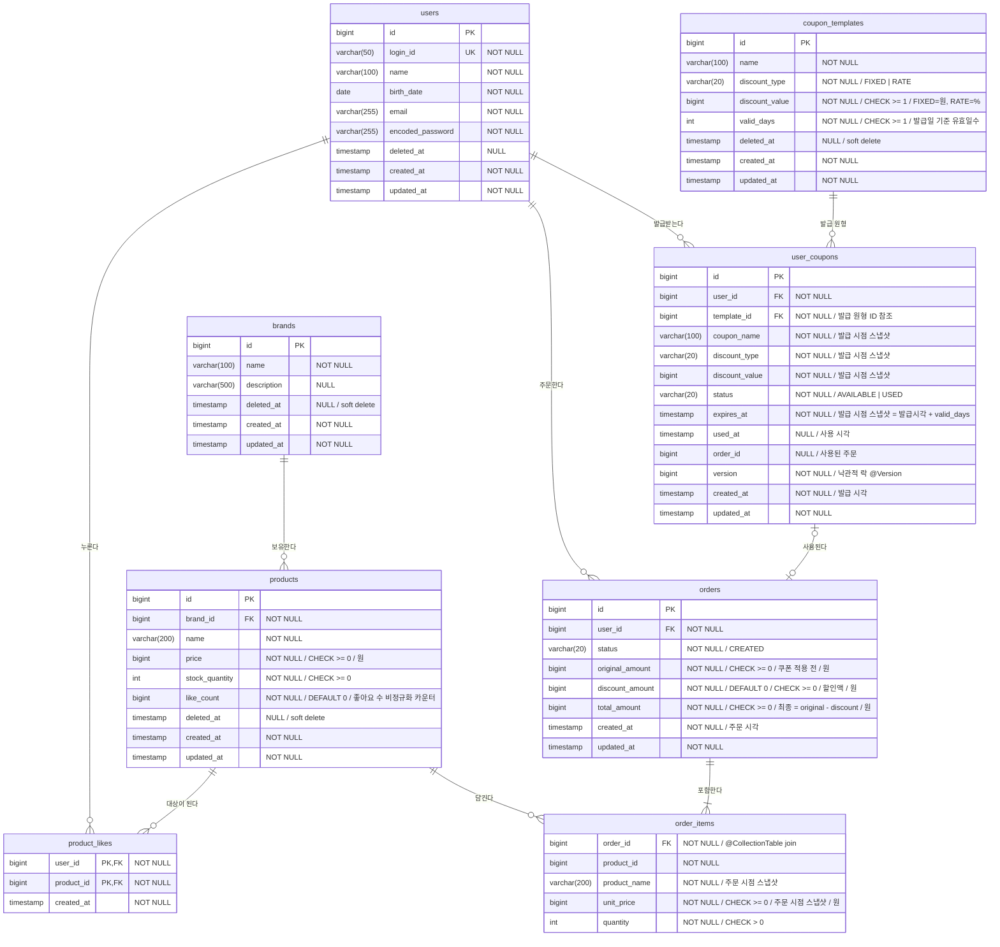

# 이커머스 DB 스키마 (ERD)

## ERD

> `order_items` 는 `Order` 애그리거트 내부의 값 컬렉션(`@ElementCollection` + `@Embeddable OrderItem`)으로 매핑된다.
> 독립 정체성이 없는 주문 시점 스냅샷이므로 대리키(`id`)와 감사 컬럼(`created_at`/`updated_at`)을 두지 않고, `order_id` 로 소속 주문에 종속된다.

---

## 테이블 상세

### 사용자 — `users`

| 컬럼 | 타입 | 제약 | 설명 |
|------|------|------|------|
| id | BIGINT | PK, IDENTITY | 대리키 |
| login_id | VARCHAR(50) | UNIQUE, NOT NULL | 로그인 식별자 |
| name | VARCHAR(100) | NOT NULL | 이름 |
| birth_date | DATE | NOT NULL | 생년월일 |
| email | VARCHAR(255) | NOT NULL | 이메일 |
| encoded_password | VARCHAR(255) | NOT NULL | 암호화된 비밀번호 |
| deleted_at | TIMESTAMP | NULL | 삭제 시각 |
| created_at | TIMESTAMP | NOT NULL | 생성 시각 |
| updated_at | TIMESTAMP | NOT NULL | 수정 시각 |

### 브랜드 — `brands`

| 컬럼 | 타입 | 제약 | 설명 |
|------|------|------|------|
| id | BIGINT | PK, IDENTITY | 대리키 |
| name | VARCHAR(100) | NOT NULL | 브랜드명 |
| description | VARCHAR(500) | NULL | 브랜드 소개 |
| deleted_at | TIMESTAMP | NULL | 삭제 시각 |
| created_at | TIMESTAMP | NOT NULL | 생성 시각 |
| updated_at | TIMESTAMP | NOT NULL | 수정 시각 |

### 상품 — `products`

| 컬럼 | 타입 | 제약 | 설명 |
|------|------|------|------|
| id | BIGINT | PK, IDENTITY | 대리키 |
| brand_id | BIGINT | FK→brands.id, NOT NULL | 소속 브랜드 |
| name | VARCHAR(200) | NOT NULL | 상품명 |
| price | BIGINT | NOT NULL, CHECK (price >= 0) | 판매가(원) |
| stock_quantity | INTEGER | NOT NULL, CHECK (stock_quantity >= 0) | 재고 수량 |
| like_count | BIGINT | NOT NULL, DEFAULT 0 | 좋아요 수 비정규화 카운터 (인덱스 `(like_count DESC, id DESC)`) |
| deleted_at | TIMESTAMP | NULL | 삭제 시각 |
| created_at | TIMESTAMP | NOT NULL | 생성 시각 |
| updated_at | TIMESTAMP | NOT NULL | 수정 시각 |

**제약** — `stock_quantity`는 `CHECK (stock_quantity >= 0)`로 음수를 막는다. 동시 주문에서의 **초과 판매(oversell) 방지**는 주문 시 대상 상품 행을 **비관적 쓰기 락**(`@Lock(PESSIMISTIC_WRITE)` → `SELECT … FOR UPDATE`)으로 잠근 뒤 차감해 보장한다 — 주문 항목 스냅샷(상품명·단가) 때문에 어차피 상품을 조회하므로, 그 조회에 락을 얹어 `재고 ≥ 수량` 검증과 차감(`Product.decreaseStock` → `Stock.decrease`)을 **락 보유 구간 안에서** 수행한다. 동시 주문은 같은 행 락을 두고 직렬화되어 read-modify-write 간극이 사라지므로, **낙관적 락의 `version` 컬럼이 필요 없다**. 여러 상품을 한 번에 잠그는 `WHERE id IN (...)` FOR UPDATE는 InnoDB가 PK 순서로 행을 잠가 동시 주문들이 같은 순서로 락을 획득하므로, 순환 대기(데드락)가 생기지 않는다.
> **기법 선택(재고 vs 좋아요)** — 좋아요 수(`like_count`)는 행을 따라가는 고경합 단순 카운터라 조건부/원자 UPDATE를 쓰지만, 재고는 ⓐ 주문 항목 스냅샷 때문에 엔티티를 **어차피 로드**하고 ⓑ 차감 규칙이 도메인(`Product.decreaseStock`)에 있어, 그 로드에 비관 락을 얹는 쪽을 택했다. 대가는 인기 상품 핫 로우에서의 **락 보유·직렬화 시간**이다(저경합이면 무는 비용이 작다).

**좋아요 수(`like_count`) — 비정규화 카운터** — 좋아요 수의 진실은 `product_likes` 행이지만, 좋아요순 정렬을 위해 매번 `COUNT` 조인/`GROUP BY`하면 비용이 **O(전체 좋아요 행)** 이라 데이터가 쌓일수록 선형으로 느려진다(측정: 좋아요 100만 행에서 첫 페이지 정렬 ~312ms vs 카운터 ~2ms). 그래서 `like_count`로 **비정규화**해 `(like_count DESC, id DESC)` 인덱스로 O(페이지) 정렬한다. 대가는 **쓰기 동시성 + 행/카운터 정합성** 책임이다:
- **정합성(멱등)**: 카운터는 행을 따라가는 종속물이므로 행이 **실제로 INSERT/DELETE 됐을 때만**(영향 행 수 == 1) 증감한다 — 등록은 `INSERT IGNORE` affected==1, 취소는 `DELETE` affected==1일 때만. 중복 좋아요로 부풀거나 없는 좋아요 취소로 음수가 되는 것을 막는다.
- **동시성**: 인기 상품에 다수가 몰리는 **고경합** 카운터라, 증감을 **원자적 UPDATE**(`SET like_count = like_count + 1`, 감소는 `- 1 WHERE like_count > 0`)로 수행해 lost update를 원천 차단한다. 행을 따라가는 고경합 단순 카운터라 낙관적 락은 재시도 폭증으로 부적합하고, 비관 락은 인기 상품에 락 보유가 길어 부적합하다 — 그래서 재고(비관 락)·쿠폰(낙관 락)과 또 다른 결인 원자 UPDATE를 택했다.

### 좋아요 — `product_likes`

| 컬럼 | 타입 | 제약 | 설명 |
|------|------|------|------|
| user_id | BIGINT | PK, FK→users.id | 좋아요한 사용자 |
| product_id | BIGINT | PK, FK→products.id | 좋아요 대상 상품 |
| created_at | TIMESTAMP | NOT NULL | 좋아요한 시각 |

**제약** — 복합 기본키 `(user_id, product_id)`: 한 사용자가 한 상품에 좋아요는 최대 1개 — 이 PK가 **멱등성의 최종 방어선**이다(애플리케이션의 존재 확인이 동시성으로 뚫려도 DB가 막는다 — 2단계 시퀀스 다이어그램). 좋아요 취소는 행을 **물리 삭제**한다. `id`·`updated_at`을 두지 않는다 — `(user_id, product_id)`가 곧 식별자이고, 한 번 누른 좋아요는 수정되지 않는 불변 행이다(3단계 클래스 다이어그램 `Like`와 일치). 좋아요 **수**는 이 행들이 진실이며, `products.like_count`는 정렬 성능을 위해 이를 비정규화한 종속 카운터다(행이 실제로 생기거나 사라질 때만 원자적으로 증감 — `products` 제약 참조).

### 주문 — `orders`

| 컬럼 | 타입 | 제약 | 설명 |
|------|------|------|------|
| id | BIGINT | PK, IDENTITY | 대리키 |
| user_id | BIGINT | FK→users.id, NOT NULL | 주문자 |
| status | VARCHAR(20) | NOT NULL, DEFAULT 'CREATED', CHECK (status = 'CREATED') | 주문 상태 |
| original_amount | BIGINT | NOT NULL, CHECK (original_amount >= 0) | 쿠폰 적용 전 금액(항목 소계 합, 원) |
| discount_amount | BIGINT | NOT NULL, DEFAULT 0, CHECK (discount_amount >= 0) | 할인액(원, 쿠폰 미사용 시 0) |
| total_amount | BIGINT | NOT NULL, CHECK (total_amount >= 0) | 최종 금액 = original − discount(원) |
| created_at | TIMESTAMP | NOT NULL | 주문 시각 |
| updated_at | TIMESTAMP | NOT NULL | 수정 시각 |

> 금액 3종(`original_amount`/`discount_amount`/`total_amount`)은 주문 시점 스냅샷이다. 할인액은 사용한 쿠폰이 계산한 결과를 그대로 저장하며, 이후 쿠폰·상품이 바뀌어도 주문 상세는 불변이다.
> **`orders`는 쿠폰을 참조하지 않는다** — 금액 결과만 보관하면 영수증으로 자립하므로, "어떤 쿠폰이 쓰였는지"는 `user_coupons.order_id`(쿠폰 → 주문 단방향)로만 기록한다. 사용 사실(상태·시각·주문)을 `user_coupons` 한쪽에 모아 양방향 중복을 피한다.

### 주문 항목 — `order_items`

`Order` 애그리거트 내부의 값 컬렉션(`@ElementCollection` + `@Embeddable OrderItem`). 대리키·감사 컬럼 없음.

| 컬럼 | 타입 | 제약 | 설명 |
|------|------|------|------|
| order_id | BIGINT | FK→orders.id, NOT NULL | 소속 주문 (`@CollectionTable` join) |
| product_id | BIGINT | NOT NULL | 참조 상품 (ID 참조 스냅샷) |
| product_name | VARCHAR(200) | NOT NULL | 상품명 (주문 시점 스냅샷) |
| unit_price | BIGINT | NOT NULL, CHECK (unit_price >= 0) | 단가 (주문 시점 스냅샷, 원) |
| quantity | INTEGER | NOT NULL, CHECK (quantity > 0) | 주문 수량 |

### 쿠폰 템플릿 — `coupon_templates`

어드민이 정의하는 쿠폰 원형. 할인 정책(`discount_type`/`discount_value`/`min_order_amount`)은 `DiscountPolicy` VO(`@Embeddable`)로 매핑된다.

| 컬럼 | 타입 | 제약 | 설명 |
|------|------|------|------|
| id | BIGINT | PK, IDENTITY | 대리키 |
| name | VARCHAR(100) | NOT NULL | 쿠폰명 |
| discount_type | VARCHAR(20) | NOT NULL | 할인 종류 (`FIXED` \| `RATE`) |
| discount_value | BIGINT | NOT NULL, CHECK (discount_value >= 1) | 할인 값 (FIXED=원, RATE=%·1~100) |
| min_order_amount | BIGINT | NOT NULL, DEFAULT 0, CHECK (min_order_amount >= 0) | 최소 주문 금액(원, `0`=제한 없음) |
| valid_days | INTEGER | NOT NULL, CHECK (valid_days >= 1) | 발급일 기준 유효일수 |
| deleted_at | TIMESTAMP | NULL | 삭제 시각 (논리 삭제) |
| created_at | TIMESTAMP | NOT NULL | 생성 시각 |
| updated_at | TIMESTAMP | NOT NULL | 수정 시각 |

**제약** — 브랜드·상품과 동일하게 논리 삭제(`deleted_at IS NULL` 필터)를 따른다. 템플릿 수정·삭제는 이후 발급분에만 영향을 주고, 이미 발급된 `user_coupons` 행에는 영향이 없다(발급 시점 스냅샷).

### 내 쿠폰 — `user_coupons`

사용자가 발급받은 쿠폰 한 장. 발급 시점에 템플릿의 혜택·이름·만료일을 **복사(스냅샷)** 해 자립한다 — `template_id`는 ID 참조일 뿐이며, 할인 계산은 이 행의 스냅샷 컬럼만으로 가능하다.

| 컬럼 | 타입 | 제약 | 설명 |
|------|------|------|------|
| id | BIGINT | PK, IDENTITY | 대리키 |
| user_id | BIGINT | FK→users.id, NOT NULL | 보유자 |
| template_id | BIGINT | FK→coupon_templates.id, NOT NULL | 발급 원형 (ID 참조) |
| coupon_name | VARCHAR(100) | NOT NULL | 쿠폰명 (발급 시점 스냅샷) |
| discount_type | VARCHAR(20) | NOT NULL | 할인 종류 (발급 시점 스냅샷) |
| discount_value | BIGINT | NOT NULL | 할인 값 (발급 시점 스냅샷) |
| min_order_amount | BIGINT | NOT NULL, DEFAULT 0 | 최소 주문 금액 (발급 시점 스냅샷, `0`=제한 없음) |
| status | VARCHAR(20) | NOT NULL, DEFAULT 'AVAILABLE', CHECK (status IN ('AVAILABLE','USED')) | 상태 (`EXPIRED`는 저장하지 않고 조회 시 파생) |
| expires_at | TIMESTAMP | NOT NULL | 만료일 (발급 시점 스냅샷 = 발급시각 + valid_days) |
| used_at | TIMESTAMP | NULL | 사용 시각 |
| order_id | BIGINT | NULL | 사용된 주문 (ID 참조) |
| version | BIGINT | NOT NULL | 낙관적 락 버전 (`@Version`) |
| created_at | TIMESTAMP | NOT NULL | 발급 시각 |
| updated_at | TIMESTAMP | NOT NULL | 수정 시각 |

**제약** — UNIQUE `(user_id, template_id)`: 한 사용자는 같은 템플릿의 쿠폰을 1장만 가진다(1인 1매). 이 유니크 제약이 **중복 발급의 최종 방어선**이다(애플리케이션의 존재 확인이 동시성으로 뚫려도 DB가 막는다). `status`는 `AVAILABLE`/`USED` 두 값만 저장하고, 만료(`EXPIRED`)는 "`AVAILABLE`이면서 `expires_at < now`"로 조회 시점에 파생한다. `order_id`는 ID 참조로만 두고 객체 그래프는 만들지 않는다.

**동시성(쿠폰)** — 한 쿠폰이 동시에 두 주문에 사용되는 것(중복 사용)은 **낙관적 락(`version` 컬럼, `@Version`)** 으로 막는다. `AVAILABLE→USED` 전이는 한 유저·한 쿠폰끼리의 **저경합**이라, "충돌은 드물다"고 가정하고 커밋 시점에 버전으로 검출하는 낙관적 락이 가장 싸다 — 동시 사용 시 한쪽만 성공하고 나머지는 충돌(`OptimisticLockingFailureException`)로 전체 주문 트랜잭션이 롤백된다(재고 차감·주문 저장까지 함께 취소 = AC-07-8의 처리 단위 유지). 재고가 **비관적 락**(주문마다 거의 확실히 잠그는 핫 로우)을 쓰는 것과 대비된다 — 쿠폰은 한 유저·한 쿠폰의 저경합이라 "충돌은 드물다"고 가정하고 무는 비용이 거의 없는 낙관 락을, 재고는 어차피 로드하는 행에 락을 얹는 비관 락을 택했다. 같은 "lost update 방지"라도 경합 정도와 연산 성격이 달라 기법을 달리한 것이다.

> **최소 주문 금액(`min_order_amount`)** — `DiscountPolicy` VO의 일부로 발급 시점에 스냅샷된다. 주문 시 적용 전 금액이 이 값 미만이면 `DiscountPolicy.calculate()`가 `BAD_REQUEST`로 거부해 주문이 성립하지 않는다(`0`이면 제한 없음). 사용 조건이지만 자기가 게이트하는 할인(`discount_type`/`value`)과 같은 VO에 두어 발급 스냅샷으로 함께 전파된다.
