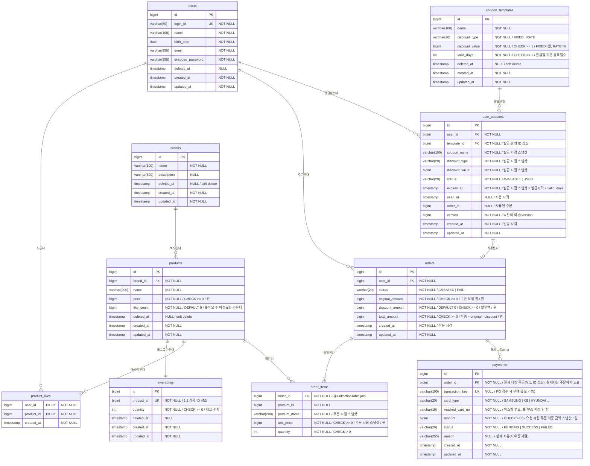

# 이커머스 DB 스키마 (ERD)

## ERD

> `order_items` 는 `Order` 애그리거트 내부의 값 컬렉션(`@ElementCollection` + `@Embeddable OrderItem`)으로 매핑된다.
> 독립 정체성이 없는 주문 시점 스냅샷이므로 대리키(`id`)와 감사 컬럼(`created_at`/`updated_at`)을 두지 않고, `order_id` 로 소속 주문에 종속된다.

---

## 테이블 상세

### 사용자 — `users`

| 컬럼 | 타입 | 제약 | 설명 |
|------|------|------|------|
| id | BIGINT | PK, IDENTITY | 대리키 |
| login_id | VARCHAR(50) | UNIQUE, NOT NULL | 로그인 식별자 |
| name | VARCHAR(100) | NOT NULL | 이름 |
| birth_date | DATE | NOT NULL | 생년월일 |
| email | VARCHAR(255) | NOT NULL | 이메일 |
| encoded_password | VARCHAR(255) | NOT NULL | 암호화된 비밀번호 |
| deleted_at | TIMESTAMP | NULL | 삭제 시각 |
| created_at | TIMESTAMP | NOT NULL | 생성 시각 |
| updated_at | TIMESTAMP | NOT NULL | 수정 시각 |

### 브랜드 — `brands`

| 컬럼 | 타입 | 제약 | 설명 |
|------|------|------|------|
| id | BIGINT | PK, IDENTITY | 대리키 |
| name | VARCHAR(100) | NOT NULL | 브랜드명 |
| description | VARCHAR(500) | NULL | 브랜드 소개 |
| deleted_at | TIMESTAMP | NULL | 삭제 시각 |
| created_at | TIMESTAMP | NOT NULL | 생성 시각 |
| updated_at | TIMESTAMP | NOT NULL | 수정 시각 |

### 상품 — `products`

| 컬럼 | 타입 | 제약 | 설명 |
|------|------|------|------|
| id | BIGINT | PK, IDENTITY | 대리키 |
| brand_id | BIGINT | FK→brands.id, NOT NULL | 소속 브랜드 |
| name | VARCHAR(200) | NOT NULL | 상품명 |
| price | BIGINT | NOT NULL, CHECK (price >= 0) | 판매가(원) |
| like_count | BIGINT | NOT NULL, DEFAULT 0 | 좋아요 수 비정규화 카운터 (인덱스 `(like_count DESC, id DESC)`) |
| deleted_at | TIMESTAMP | NULL | 삭제 시각 |
| created_at | TIMESTAMP | NOT NULL | 생성 시각 |
| updated_at | TIMESTAMP | NOT NULL | 수정 시각 |

> **재고 분리** — 재고는 `products`에서 떼어 별도 애그리거트 `inventories`로 둔다(아래 표). `products` 행은 더 이상 `stock_quantity`를 갖지 않으며, 주문의 비관락은 `products`가 아니라 `inventories` 행을 잠근다.
> **조회 정렬 인덱스 (Round 5)** — 상품 목록의 3개 정렬 유즈케이스를 인덱스로 받친다(전후 EXPLAIN 측정치는 벤치마크 노트 참조):
> - **좋아요순**: 전역 `(like_count DESC, id DESC)`, 브랜드 필터 `(brand_id, like_count DESC, id DESC)`. 후자는 등치 `brand_id`를 선행시켜 **브랜드 선택도와 무관하게** Top-N이 안정적이다(선택도 큰 브랜드도 filesort 없이 페이지 단위만 읽음).
> - **가격 오름차순**: 전역 `(price, id DESC)`, 브랜드 필터 `(brand_id, price, id DESC)`. 전역의 경우 InnoDB secondary index 는 리프에 PK(`id ASC`)가 **암묵 부착**되므로 단일 `(price)`만으로는 `ORDER BY price ASC, id DESC` 의 타이브레이크가 어긋나 filesort 가 잔존한다 — 그래서 `id DESC` 를 명시한 복합 인덱스를 둔다. 브랜드 필터는 등치 `brand_id`를 선행시켜 그 안에서 `price` 정렬을 인덱스 순서로 풀어 filesort 를 제거한다(좋아요순 브랜드 변형과 동일한 결).
> - **최신순**: **별도 인덱스 없음**. `id` 가 auto_increment 라 `id DESC` 가 곧 생성 역순이고, 이는 **클러스터 인덱스(PK) 역스캔**으로 풀린다 — `created_at` 정렬용 인덱스가 불필요하다.

### 재고 — `inventories`

| 컬럼 | 타입 | 제약 | 설명 |
|------|------|------|------|
| id | BIGINT | PK, IDENTITY | 대리키 |
| product_id | BIGINT | UNIQUE, NOT NULL | 상품 ID 참조(1:1, 객체 그래프 없음) |
| quantity | INTEGER | NOT NULL, CHECK (quantity >= 0) | 재고 수량 |
| deleted_at | TIMESTAMP | NULL | 삭제 시각 |
| created_at | TIMESTAMP | NOT NULL | 생성 시각 |
| updated_at | TIMESTAMP | NOT NULL | 수정 시각 |

**제약/동시성** — `quantity`는 `CHECK (quantity >= 0)`로 음수를 막는다. 동시 주문의 **초과 판매(oversell) 방지**는 주문 시 대상 **`inventories` 행을 비관적 쓰기 락**(`@Lock(PESSIMISTIC_WRITE)` → `SELECT … FOR UPDATE`)으로 잠근 뒤 `재고 ≥ 수량` 검증·차감(`Inventory.decrease`)을 **락 보유 구간 안에서** 수행해 보장한다. 동시 주문은 같은 행 락에 직렬화되어 read-modify-write 간극이 사라지므로 **낙관적 락 `version`이 필요 없다**. 여러 상품을 한 번에 잠그는 조회는 `findAllByProductIdInAndDeletedAtIsNullOrderByProductIdAsc`로 **product_id 오름차순** 락을 획득해 순환 대기(데드락)를 피한다.
> **삭제↔주문 경쟁 차단 (소프트 삭제 cascade)** — 상품 삭제는 `products`뿐 아니라 **그 `inventories` 행도 함께 소프트 삭제**한다(개별 삭제: `deleted_at` set, 브랜드 일괄 삭제: 대상 상품 id 들의 재고를 벌크 소프트 삭제). 삭제의 재고 UPDATE 는 그 행에 쓰기 락을 잡아 주문의 `FOR UPDATE` 와 **같은 행 락에 직렬화**되고, 주문의 락 조회는 `deleted_at IS NULL` 로 필터한다 — 그래서 삭제가 먼저 커밋되면 주문은 그 행을 잠그지 못하고 "재고 없음"으로 거부된다(주문이 먼저면 정상 차감 후 삭제). 재고를 `products`에서 떼어내며 "판매 가능성"의 권위를 `inventories` 행으로 모은 것이라, 주문·삭제가 한 락 도메인에서 만난다(좋아요 카운터는 여전히 `products`에 격리). `inventories` 도 `@DynamicUpdate` 라, 소프트 삭제 시 `deleted_at` 만 UPDATE 해 동시 주문의 `quantity` 차감을 덮어쓰지 않는다.
> **왜 분리했나 (false sharing 제거)** — 재고(`inventories`)와 좋아요 카운터(`products.like_count`)를 한 행에 두면, 주문의 비관락(트랜잭션 내내 행 보유)과 좋아요의 원자 UPDATE가 **논리적으로 무관한데 같은 물리 행 락을 두고 싸운다**(= false sharing). 실측상 주문 락 보유가 길어질수록 같은 상품의 좋아요 p99가 수 배~수십 배 악화됐다. 재고를 별도 행으로 떼면 두 쓰기의 락 도메인이 분리돼 서로를 막지 않는다. 읽기(상품 상세/목록의 품절·재고)는 `inventories`를 배치 조인하지만 좁은 PK 조인이라 비용은 무시할 수준. 대가는 모델 복잡도(상품 생성 시 재고 행도 함께 생성)다.
> **기법 선택(재고 vs 좋아요 vs 쿠폰)** — 재고는 ⓐ 차감 규칙이 도메인(`Inventory.decrease`)에 있고 ⓑ oversell이 돈/정합성에 직결돼 **비관 락**(행 직렬화)을, 좋아요 수는 고경합 단순 카운터라 **원자 UPDATE**를, 쿠폰은 저경합이라 **낙관 락(`@Version`)** 을 택했다 — 경합 정도와 연산 성격이 달라 기법을 달리한 것이다.

**좋아요 수(`like_count`) — 비정규화 카운터** — 좋아요 수의 진실은 `product_likes` 행이지만, 좋아요순 정렬을 위해 매번 `COUNT` 조인/`GROUP BY`하면 비용이 **O(전체 좋아요 행)** 이라 데이터가 쌓일수록 선형으로 느려진다(측정: 좋아요 100만 행에서 첫 페이지 정렬 ~312ms vs 카운터 ~2ms). 그래서 `like_count`로 **비정규화**해 `(like_count DESC, id DESC)` 인덱스로 O(페이지) 정렬한다. 대가는 **쓰기 동시성 + 행/카운터 정합성** 책임이다:
- **정합성(멱등)**: 카운터는 행을 따라가는 종속물이므로 행이 **실제로 INSERT/DELETE 됐을 때만**(영향 행 수 == 1) 증감한다 — 등록은 `INSERT IGNORE` affected==1, 취소는 `DELETE` affected==1일 때만. 중복 좋아요로 부풀거나 없는 좋아요 취소로 음수가 되는 것을 막는다.
- **동시성**: 인기 상품에 다수가 몰리는 **고경합** 카운터라, 증감을 **원자적 UPDATE**(`SET like_count = like_count + 1`, 감소는 `- 1 WHERE like_count > 0`)로 수행해 lost update를 원천 차단한다. 행을 따라가는 고경합 단순 카운터라 낙관적 락은 재시도 폭증으로 부적합하고, 비관 락은 인기 상품에 락 보유가 길어 부적합하다 — 그래서 재고(비관 락)·쿠폰(낙관 락)과 또 다른 결인 원자 UPDATE를 택했다.
- **원자 UPDATE 보호(`@DynamicUpdate`)**: 같은 행에 *전체 컬럼 UPDATE 대상*(상품 수정/삭제의 name·price·deleted_at)과 *원자 UPDATE 대상*(like_count)이 공존하므로, 상품 수정이 적재 시점의 stale `like_count`를 전체 UPDATE로 되써 동시 좋아요 증감을 덮어쓸 수 있다. `Product` 에 `@DynamicUpdate` 를 두어 변경된 컬럼만 UPDATE 하므로 `like_count` 는 dirty 가 아닌 한 UPDATE 에서 빠진다(재고가 `inventories` 로 분리됐어도 `like_count` 는 정렬 인덱스 때문에 `products` 에 남아야 해서, 분리가 아니라 부분 UPDATE 로 막는다).

### 좋아요 — `product_likes`

| 컬럼 | 타입 | 제약 | 설명 |
|------|------|------|------|
| user_id | BIGINT | PK, FK→users.id | 좋아요한 사용자 |
| product_id | BIGINT | PK, FK→products.id | 좋아요 대상 상품 |
| created_at | TIMESTAMP | NOT NULL | 좋아요한 시각 |

**제약** — 복합 기본키 `(user_id, product_id)`: 한 사용자가 한 상품에 좋아요는 최대 1개 — 이 PK가 **멱등성의 최종 방어선**이다(애플리케이션의 존재 확인이 동시성으로 뚫려도 DB가 막는다 — 2단계 시퀀스 다이어그램). 좋아요 취소는 행을 **물리 삭제**한다. `id`·`updated_at`을 두지 않는다 — `(user_id, product_id)`가 곧 식별자이고, 한 번 누른 좋아요는 수정되지 않는 불변 행이다(3단계 클래스 다이어그램 `Like`와 일치). 좋아요 **수**는 이 행들이 진실이며, `products.like_count`는 정렬 성능을 위해 이를 비정규화한 종속 카운터다(행이 실제로 생기거나 사라질 때만 원자적으로 증감 — `products` 제약 참조).

### 주문 — `orders`

| 컬럼 | 타입 | 제약 | 설명 |
|------|------|------|------|
| id | BIGINT | PK, IDENTITY | 대리키 |
| user_id | BIGINT | FK→users.id, NOT NULL | 주문자 |
| status | VARCHAR(20) | NOT NULL, DEFAULT 'CREATED', CHECK (status IN ('CREATED','PAID')) | 주문 상태 (`PAID`=결제 성공 콜백 시 전이, Round 6) |
| original_amount | BIGINT | NOT NULL, CHECK (original_amount >= 0) | 쿠폰 적용 전 금액(항목 소계 합, 원) |
| discount_amount | BIGINT | NOT NULL, DEFAULT 0, CHECK (discount_amount >= 0) | 할인액(원, 쿠폰 미사용 시 0) |
| total_amount | BIGINT | NOT NULL, CHECK (total_amount >= 0) | 최종 금액 = original − discount(원) |
| created_at | TIMESTAMP | NOT NULL | 주문 시각 |
| updated_at | TIMESTAMP | NOT NULL | 수정 시각 |

> 금액 3종(`original_amount`/`discount_amount`/`total_amount`)은 주문 시점 스냅샷이다. 할인액은 사용한 쿠폰이 계산한 결과를 그대로 저장하며, 이후 쿠폰·상품이 바뀌어도 주문 상세는 불변이다.
> **`orders`는 쿠폰을 참조하지 않는다** — 금액 결과만 보관하면 영수증으로 자립하므로, "어떤 쿠폰이 쓰였는지"는 `user_coupons.order_id`(쿠폰 → 주문 단방향)로만 기록한다. 사용 사실(상태·시각·주문)을 `user_coupons` 한쪽에 모아 양방향 중복을 피한다.

### 주문 항목 — `order_items`

`Order` 애그리거트 내부의 값 컬렉션(`@ElementCollection` + `@Embeddable OrderItem`). 대리키·감사 컬럼 없음.

| 컬럼 | 타입 | 제약 | 설명 |
|------|------|------|------|
| order_id | BIGINT | FK→orders.id, NOT NULL | 소속 주문 (`@CollectionTable` join) |
| product_id | BIGINT | NOT NULL | 참조 상품 (ID 참조 스냅샷) |
| product_name | VARCHAR(200) | NOT NULL | 상품명 (주문 시점 스냅샷) |
| unit_price | BIGINT | NOT NULL, CHECK (unit_price >= 0) | 단가 (주문 시점 스냅샷, 원) |
| quantity | INTEGER | NOT NULL, CHECK (quantity > 0) | 주문 수량 |

### 쿠폰 템플릿 — `coupon_templates`

어드민이 정의하는 쿠폰 원형. 할인 정책(`discount_type`/`discount_value`/`min_order_amount`)은 `DiscountPolicy` VO(`@Embeddable`)로 매핑된다.

| 컬럼 | 타입 | 제약 | 설명 |
|------|------|------|------|
| id | BIGINT | PK, IDENTITY | 대리키 |
| name | VARCHAR(100) | NOT NULL | 쿠폰명 |
| discount_type | VARCHAR(20) | NOT NULL | 할인 종류 (`FIXED` \| `RATE`) |
| discount_value | BIGINT | NOT NULL, CHECK (discount_value >= 1) | 할인 값 (FIXED=원, RATE=%·1~100) |
| min_order_amount | BIGINT | NOT NULL, DEFAULT 0, CHECK (min_order_amount >= 0) | 최소 주문 금액(원, `0`=제한 없음) |
| valid_days | INTEGER | NOT NULL, CHECK (valid_days >= 1) | 발급일 기준 유효일수 |
| deleted_at | TIMESTAMP | NULL | 삭제 시각 (논리 삭제) |
| created_at | TIMESTAMP | NOT NULL | 생성 시각 |
| updated_at | TIMESTAMP | NOT NULL | 수정 시각 |

**제약** — 브랜드·상품과 동일하게 논리 삭제(`deleted_at IS NULL` 필터)를 따른다. 템플릿 수정·삭제는 이후 발급분에만 영향을 주고, 이미 발급된 `user_coupons` 행에는 영향이 없다(발급 시점 스냅샷).

### 내 쿠폰 — `user_coupons`

사용자가 발급받은 쿠폰 한 장. 발급 시점에 템플릿의 혜택·이름·만료일을 **복사(스냅샷)** 해 자립한다 — `template_id`는 ID 참조일 뿐이며, 할인 계산은 이 행의 스냅샷 컬럼만으로 가능하다.

| 컬럼 | 타입 | 제약 | 설명 |
|------|------|------|------|
| id | BIGINT | PK, IDENTITY | 대리키 |
| user_id | BIGINT | FK→users.id, NOT NULL | 보유자 |
| template_id | BIGINT | FK→coupon_templates.id, NOT NULL | 발급 원형 (ID 참조) |
| coupon_name | VARCHAR(100) | NOT NULL | 쿠폰명 (발급 시점 스냅샷) |
| discount_type | VARCHAR(20) | NOT NULL | 할인 종류 (발급 시점 스냅샷) |
| discount_value | BIGINT | NOT NULL | 할인 값 (발급 시점 스냅샷) |
| min_order_amount | BIGINT | NOT NULL, DEFAULT 0 | 최소 주문 금액 (발급 시점 스냅샷, `0`=제한 없음) |
| status | VARCHAR(20) | NOT NULL, DEFAULT 'AVAILABLE', CHECK (status IN ('AVAILABLE','USED')) | 상태 (`EXPIRED`는 저장하지 않고 조회 시 파생) |
| expires_at | TIMESTAMP | NOT NULL | 만료일 (발급 시점 스냅샷 = 발급시각 + valid_days) |
| used_at | TIMESTAMP | NULL | 사용 시각 |
| order_id | BIGINT | NULL | 사용된 주문 (ID 참조) |
| version | BIGINT | NOT NULL | 낙관적 락 버전 (`@Version`) |
| created_at | TIMESTAMP | NOT NULL | 발급 시각 |
| updated_at | TIMESTAMP | NOT NULL | 수정 시각 |

**제약** — UNIQUE `(user_id, template_id)`: 한 사용자는 같은 템플릿의 쿠폰을 1장만 가진다(1인 1매). 이 유니크 제약이 **중복 발급의 최종 방어선**이다(애플리케이션의 존재 확인이 동시성으로 뚫려도 DB가 막는다). `status`는 `AVAILABLE`/`USED` 두 값만 저장하고, 만료(`EXPIRED`)는 "`AVAILABLE`이면서 `expires_at < now`"로 조회 시점에 파생한다. `order_id`는 ID 참조로만 두고 객체 그래프는 만들지 않는다.

**동시성(쿠폰)** — 한 쿠폰이 동시에 두 주문에 사용되는 것(중복 사용)은 **낙관적 락(`version` 컬럼, `@Version`)** 으로 막는다. `AVAILABLE→USED` 전이는 한 유저·한 쿠폰끼리의 **저경합**이라, "충돌은 드물다"고 가정하고 커밋 시점에 버전으로 검출하는 낙관적 락이 가장 싸다 — 동시 사용 시 한쪽만 성공하고 나머지는 충돌(`OptimisticLockingFailureException`)로 전체 주문 트랜잭션이 롤백된다(재고 차감·주문 저장까지 함께 취소 = AC-07-8의 처리 단위 유지). 재고가 **비관적 락**(주문마다 거의 확실히 잠그는 핫 로우)을 쓰는 것과 대비된다 — 쿠폰은 한 유저·한 쿠폰의 저경합이라 "충돌은 드물다"고 가정하고 무는 비용이 거의 없는 낙관 락을, 재고는 어차피 로드하는 행에 락을 얹는 비관 락을 택했다. 같은 "lost update 방지"라도 경합 정도와 연산 성격이 달라 기법을 달리한 것이다.

> **최소 주문 금액(`min_order_amount`)** — `DiscountPolicy` VO의 일부로 발급 시점에 스냅샷된다. 주문 시 적용 전 금액이 이 값 미만이면 `DiscountPolicy.calculate()`가 `BAD_REQUEST`로 거부해 주문이 성립하지 않는다(`0`이면 제한 없음). 사용 조건이지만 자기가 게이트하는 할인(`discount_type`/`value`)과 같은 VO에 두어 발급 스냅샷으로 함께 전파된다.

### 결제 — `payments` (Round 6)

생성된 주문에 대한 **한 번의 결제 시도**. 한 주문에 시도가 여러 개일 수 있어 `order_id`로 주문을 ID 참조하는 **N:1**이며, 주문은 결제를 역참조하지 않는다(쿠폰처럼 단방향 — "결제됐는지"는 `orders.status='PAID'`로, "어느 시도로"는 `payments`가 보관). 금액·카드는 외부 PG로 청구하는 값이라 **요청 시점 스냅샷**으로 둔다.

| 컬럼 | 타입 | 제약 | 설명 |
|------|------|------|------|
| id | BIGINT | PK, IDENTITY | 대리키 |
| order_id | BIGINT | FK→orders.id, NOT NULL | 결제 대상 주문 (ID 참조, N:1). 결제자는 주문에서 도출(userId 미보유) |
| transaction_key | VARCHAR(100) | UNIQUE, NULL | PG 접수 시 부여(요청 타임아웃 시 유실 가능) |
| card_type | VARCHAR(20) | NOT NULL | 카드사 (`SAMSUNG` \| `KB` \| `HYUNDAI` …) |
| masked_card_no | VARCHAR(19) | NOT NULL | 마스킹 카드번호(`**** **** **** 1451`). 풀 PAN은 저장 안 함(PCI) |
| amount | BIGINT | NOT NULL, CHECK (amount >= 0) | 요청 시점 주문 최종 금액 스냅샷(원) |
| status | VARCHAR(20) | NOT NULL, DEFAULT 'PENDING', CHECK (status IN ('PENDING','SUCCESS','FAILED')) | 결제 상태 |
| reason | VARCHAR(255) | NULL | 실패 사유(자유 문자열, `FAILED`일 때 PG 사유 기록) |
| created_at | TIMESTAMP | NOT NULL | 생성 시각 |
| updated_at | TIMESTAMP | NOT NULL | 수정 시각 |

**제약** — `status`는 세 값만 가지며 전이는 `PENDING → SUCCESS`/`PENDING → FAILED` 단방향이다(`PENDING`은 "처리 중 + 타임아웃으로 모름"을 함께 흡수, 별도 `UNKNOWN` 없음). `reason`은 `FAILED`일 때 PG 사유를 자유 문자열로 기록한다(별도 enum 없음). `transaction_key`는 nullable·UNIQUE이며, 현재 콜백/조회의 결제 매칭은 이 키로 한다 — 요청 타임아웃으로 거래키 응답이 유실된 결제(in-doubt)는 키가 없어 이 매칭이 안 되므로 `order_id` 상관키 매칭은 후속 하드닝으로 남긴다. 한 주문에 여러 시도가 정상이므로 `order_id`에는 유니크를 두지 않는다(주문당 1건이 아니라 시도당 1건).

**이중결제 (요청 중복/따닥) — 주문 행 비관락** — 사용자 더블클릭·동시 요청으로 같은 주문이 두 번 청구되는 것을, 결제 예약 시 **주문 행을 `SELECT ... FOR UPDATE`로 잠그고** "살아있는 시도(`PENDING`·`SUCCESS`)가 있으면 차단" + `PENDING` 저장을 한 트랜잭션에서 처리해 막는다(검사+삽입 원자화). `if 존재? 차단 : 생성`(read-then-write)은 동시 더블클릭이 둘 다 "없음"을 읽는 창이 있으나, 주문 행 락이 그 경쟁을 직렬화해 패자가 승자의 `PENDING`을 보고 `CONFLICT`가 되게 한다. 락은 PG 호출 **전에** 해제한다(외부 청구를 락 안에 품지 않음). `FAILED`만 있으면 정당한 재시도로 허용한다. cf. 멱등키(클라 발급 키 + UNIQUE) 대신 비관락을 택했다 — `order_id`가 이미 자연 키라 새 식별자/클라 계약이 불필요하고, 외부 청구가 트랜잭션 한가운데 있어 "호출 전 직렬화"가 필요하기 때문(낙관락은 commit=청구 이후 감지라 부적합).

**동시성 (결과 확정) — 종결 no-op 가드** — 콜백은 at-least-once라 같은 결제에 여러 번 올 수 있고, 콜백과 정산(상태 조회)이 같은 `PENDING`을 동시에 종결시키려 경쟁할 수 있다. 이를 **종결 상태 no-op 전이 가드**(`SUCCESS`/`FAILED`면 무시·`false` 반환, `PENDING`에서만 전이)로 흡수하고, **전이가 실제 일어났을 때만** `orders.status`를 `PAID`로 반영한다. 지금은 `PAID` 전이가 순수 상태 변경이라 같은 값으로의 동시 전이가 무해해 별도 락이 불필요하지만, `PAID`에 부작용(적립·알림)이 붙으면 이중 실행이 되므로 그 시점에 낙관락(`@Version`)을 도입한다(**현재 미적용**).

> **기법 선택(재고 vs 좋아요 vs 쿠폰 vs 결제)** — 재고는 oversell 직결이라 **비관 락**, 좋아요는 고경합 단순 카운터라 **원자 UPDATE**, 쿠폰은 저경합 상태 전이라 **낙관 락**, 결제는 ⓐ 요청 중복(따닥)을 **주문 행 비관 락**으로, ⓑ 결과 확정 경쟁(*외부 재전송·중복 통지*)을 **종결 no-op 가드**로 막는다 — 경합 상대와 연산 성격이 모두 달라 기법을 달리한 것이다.
> **트랜잭션 경계(dual-write)** — `payments`의 `PENDING` 행은 PG 호출 **전에** 커밋된다(외부 호출은 트랜잭션 밖). 외부 응답 시간만큼 커넥션·락을 잡지 않게 하고, 이후 콜백/정산이 매칭할 대상을 먼저 만들어 두기 위함이다. 외부 호출의 부작용(승인)은 우리 트랜잭션으로 롤백되지 않으므로, "먼저 PENDING 기록 → 외부 호출 → 결과로 종결"이라는 순서 자체가 정합성의 뿌리다(2단계 시퀀스 4-1).
